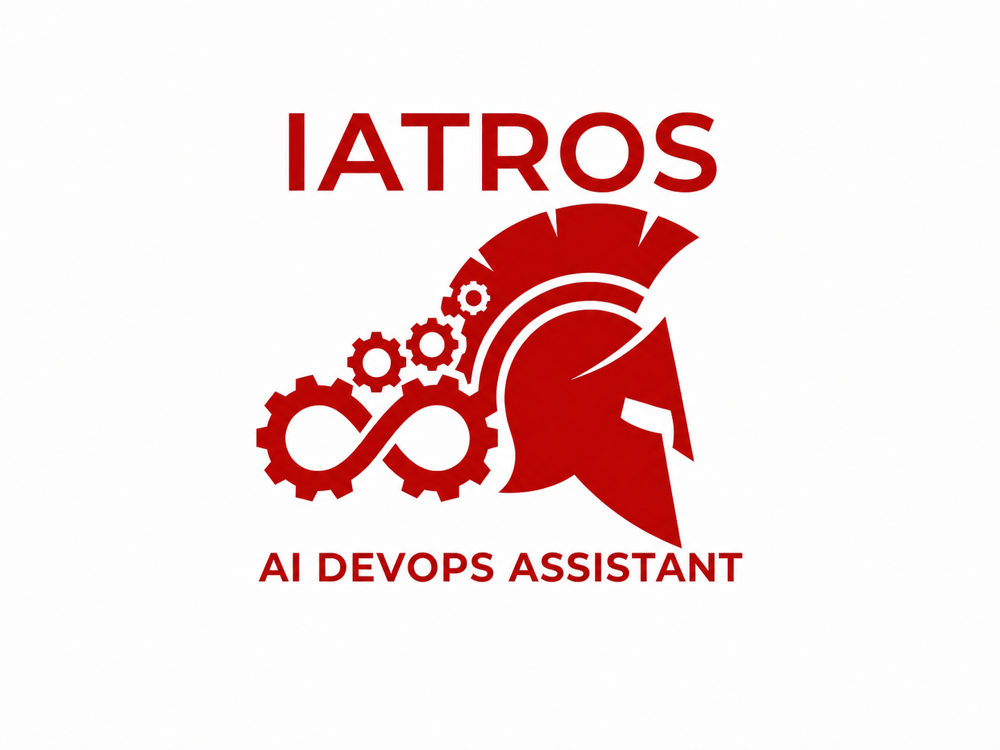

<p align="center">
  
</p>

<h1 align="center">IATROS DevOps</h1>

<p align="center">
  Provider-neutral DevOps automation with a free local foundation and optional AI assistance.
</p>

<p align="center">
  <a href="LICENSE">
    
  </a>
</p>

> [!IMPORTANT]
> **Project status:** Early implementation. The repository contains two runnable local, read-only workflows. `iatros analyze` performs bounded metadata discovery, technology detection, and five conservative readiness checks. `iatros topology` safely parses allowlisted manifests and reports projects, components, workspaces, and direct dependency relationships. Both commands support explicit `small` and `monorepo` scaling profiles and return deterministic text or JSON. Broader AI, remote-provider, generation, and operational capabilities remain planned, not released.

## Overview

IATROS DevOps is intended to help users build, deploy, operate, troubleshoot, and improve software through deterministic workflows with optional AI assistance. The long-term goal is to connect repository context and operational intent with tools that can analyze projects, prepare infrastructure and delivery artifacts, validate proposed changes, and assist with day-to-day operations.

The proposed architecture separates provider-neutral domain logic from vendor-specific integrations. Stable contracts are intended to connect the core, public interfaces, plugins, and optional extensions without coupling the entire system to a particular cloud, source-control platform, observability backend, or AI provider.

## Planned capabilities

- **Project understanding:** discover repositories, model topology, and assess production readiness.
- **Deterministic architecture generation:** use validated templates, rules, catalogs, and open plugins to prepare Docker and supported DevOps architecture locally in Basic.
- **Optional AI assistance:** add cloud AI in Pro or cloud/local AI in Enterprise for planning, generation, risk analysis, diagnosis, and remediation.
- **Delivery and infrastructure generation:** prepare CI/CD pipelines, infrastructure, orchestration, observability, security, container configurations, scripts, and operational documentation.
- **Validation and diagnostics:** check proposed artifacts and provide an IATROS Doctor workflow for actionable findings.
- **Deployment operations:** assist with promotion, rollback, GitOps workflows, and drift detection.
- **Operational insight:** bring together observability, reliability, security, and cost-awareness workflows.
- **Extensible integrations:** create open plugins in every plan and closed private plugins in Enterprise through stable contracts.

These items describe the intended product direction. Only the local repository analysis and topology slice described below is currently runnable.

The first approved implementation slice is [local repository analysis](docs/product/0001-local-repository-analysis.md): local-only, read-only `iatros analyze` and `iatros topology` commands with deterministic text and JSON contracts.

## Architecture and repository layout

The scaffold is organized around explicit product and dependency boundaries.

The complete architecture package is available in [`docs/`](docs/README.md), including the [target architecture](docs/architecture/README.md), [project and workspace boundary model](docs/architecture/project-model.md), [security architecture](docs/architecture/security.md), [testing strategy](docs/architecture/testing.md), and [architecture decision records](docs/architecture/decisions/README.md).

| Path | Intended responsibility |
| --- | --- |
| [`api/`](api/) | Public wire contracts; API implementations are intended to live elsewhere. |
| [`apps/`](apps/) | Planned dashboard, GitHub, GitLab, and IDE-facing application surfaces. |
| [`assets/`](assets/) | Project branding and other static repository assets. |
| [`cmd/`](cmd/) | Thin entry points for the agent, control plane, IATROS CLI, Model Context Protocol (MCP) server, and worker. |
| [`deploy/`](deploy/) | Deployment resources for IATROS itself. |
| [`docs/`](docs/) | Product specifications, architecture, security, testing, and decision records. |
| [`examples/`](examples/) | Planned CLI, SDK, and plugin usage examples. |
| [`extensions/`](extensions/) | Reserved Pro and Enterprise product overlays; customer-specific closed plugin source may be distributed separately. |
| [`internal/`](internal/) | Private, provider-neutral application and domain logic. |
| [`plugins/`](plugins/) | Planned open first-party adapters grouped by capability. |
| [`sdk/`](sdk/) | Intended public Go client, plugin and extension contracts, and a plugin-testing toolkit. |
| [`test/`](test/) | Cross-component integration and end-to-end test suites. |

The intended dependency rules are:

1. Maintain one provider-neutral core that remains fully usable through Basic without Pro or Enterprise capabilities; do not duplicate core packages by subscription.
2. Keep business logic out of `cmd`; executable entry points should only compose applications.
3. Keep `internal` independent from concrete plugins and optional extensions.
4. Plugins should depend on stable contracts in `sdk/plugin` and, where necessary, `api` or `sdk/client`; optional extensions should implement `sdk/extension` or `sdk/plugin`.
5. Keep public `api` and `sdk` packages independent from private `internal` packages.
6. Place provider-specific integrations in `plugins` rather than in the core.

## Current repository state

| Area | Current state |
| --- | --- |
| Directory scaffold | Present |
| Project identity, logo, and license | Present |
| First product specification | Approved; initial local analysis implemented |
| Target architecture, security, and testing documentation | Present |
| Application source and Go module | Root module and initial CLI source present |
| Runnable CLI, services, and applications | Local analysis and repository-topology CLI available; other runtimes not implemented |
| Internal project model | Strong filename-based project and workspace boundaries implemented and exposed through topology reports |
| Scaling profiles | Unified `small`, `monorepo`, and Enterprise per-worker profiles implemented; `small` and `monorepo` selectable in the default CLI |
| Internal manifest model | Seven bounded manifest formats, normalized direct declarations, unified resource profiles, and replaceable parser backends implemented |
| Internal topology model | Project/component association, nested and overlapping workspaces, safe member resolution, local dependency edges, and public CLI report mapping implemented |
| API, SDK, plugins, and extensions | Directory placeholders only |
| Automated tests and CI workflows | Unit and local integration tests present; CI workflows not yet added |
| Published releases | Not yet available |

## Getting started

The current development baseline requires Go 1.25.5 or newer.

```bash
git clone https://github.com/kVinsom/Iatros.git
cd Iatros
go test ./...
go vet ./...
go build ./...
```

Inspect the command surface and version directly from source:

```bash
go run ./cmd/iatros help
go run ./cmd/iatros version
```

Build and run the analyzer on Linux or macOS:

```bash
go build -o ./bin/iatros ./cmd/iatros
./bin/iatros analyze --format json .
```

On Windows PowerShell:

```powershell
go build -o .\bin\iatros.exe .\cmd\iatros
.\bin\iatros.exe analyze --format json .
```

`path` defaults to the current directory and must identify an existing local directory. Text is the default format:

```bash
./bin/iatros analyze /path/to/repository
./bin/iatros analyze --format text /path/to/repository
./bin/iatros analyze --format json /path/to/repository
./bin/iatros analyze --profile monorepo /path/to/monorepo
./bin/iatros topology /path/to/repository
./bin/iatros topology --format text /path/to/repository
./bin/iatros topology --format json /path/to/repository
./bin/iatros topology --profile monorepo /path/to/monorepo
```

Both commands return exit code `0` for complete and explicitly partial reports. Readiness findings do not fail `analyze`. Invalid usage returns `2`, an invalid or inaccessible target returns `3`, and an operational or internal failure returns `1`. Exit code `4` remains reserved for an `analyze` implementation that explicitly reports `not_implemented`; the default CLI does not use that placeholder.

## Local analysis behavior

The first runnable workflow is deliberately narrow and deterministic:

```text
local directory
      |
      v
bounded ignore-aware discovery
      |
      v
filename-based technology detection
      |
      v
conservative readiness evaluation
      |
      v
versioned report -> text or JSON
```

The analyzer:

- walks one local root using directory entries, file metadata, and only bounded `.gitignore` and `.gitmodules` control-file reads;
- retains at most 2,000 files, 500 directories, 100 ignore files, 10,000 ignore rules of at most 4 KiB each, and 100 nested repository boundaries; traverses at most 20 levels; accepts at most 2,500 entries per directory; retains at most 50 discovery issues; and uses a five-second discovery deadline;
- applies root and nested Git-style ignore rules with ordered scope, negation, anchoring, directory-only patterns, escaping, wildcards, ranges, and globstars;
- detects declared submodules and nested Git worktrees, records their roots, and does not attribute their contents to the parent repository;
- skips VCS metadata plus common generated dependency and tool-state directories (`.gradle`, `.pnpm`, `.terraform`, `.venv`, `.yarn`, `node_modules`, and `venv`), symbolic links, junction-like irregular entries, and other irregular files;
- returns sorted slash-separated paths relative to the selected root;
- matches 124 filename-marker rules across 15 categories, including 18 common backend languages, three runtimes, 23 dependency managers, build systems, containers, orchestration, infrastructure as code, configuration management, CI/CD, GitOps, observability, networking, security, secrets, and cloud tooling;
- retains at most 20 evidence paths for each detected technology and reports when additional evidence was truncated;
- checks for a root README, root license, root `.gitignore`, supported test markers for detected code ecosystems, and supported CI/CD configuration;
- suppresses all absence-based readiness findings when discovery is partial, because skipped paths make absence untrustworthy;
- maps access failures and reached limits to structured report diagnostics instead of silently presenting an incomplete scan as complete.

The detector reports direct filename evidence only. A marker does not prove that a technology is installed, correctly configured, secure, used in production, or applicable to every project in a monorepository. See the complete [technology catalog](docs/architecture/detection.md) and [readiness rules](docs/architecture/readiness.md).

The [repository discovery contract](docs/architecture/repository-discovery.md) defines ignore behavior, large-file safety, and nested-repository isolation. The [project and workspace boundary model](docs/architecture/project-model.md) recognizes nested code, infrastructure, mixed-project, and workspace roots from the same bounded inventory. The [manifest analysis stage](docs/architecture/manifest-analysis.md) safely parses `go.mod`, `go.work`, `package.json`, `pyproject.toml`, `Cargo.toml`, `composer.json`, and `pom.xml` into normalized direct declarations. Explicit Go, Node.js, and Cargo workspace declarations remain distinguishable from an absent declaration even when they contain no members. The [topology stage](docs/architecture/topology.md) associates both models, resolves repository-confined workspace members, and identifies direct local dependency edges. `iatros topology` exposes those normalized facts through its separate `repository_topology` schema `0.3`. The core also contains a tested [change-impact analyzer](docs/architecture/change-impact.md) over normalized system maps and a [unified finding model](docs/architecture/findings.md) with controlled, time-bounded exclusions; Git change collection and impact CLI integration remain pending.

IATROS uses the same provider-neutral core for small projects, large company monorepositories, and Enterprise compositions. One [scaling profile](docs/architecture/scaling-profiles.md) configures discovery, evidence, project boundaries, manifest parsing, topology association, system maps, remote metadata, change impact, findings, and exclusions together. `small` is the default, `monorepo` is an explicit CLI opt-in, and the validated `enterprise` per-worker profile requires an Enterprise-aware composition. Parser backends remain replaceable behind the same limits, cancellation, normalization, redaction, determinism, and diagnostic contracts.

### Report contract

Text and JSON are two renderings of the same analysis report. Its current JSON schema is `1.0`; its top-level fields are always present. Version `1.0` uses the unified structured finding contract. The independent topology report remains schema `0.3`.

```json
{
  "schema_version": "1.0",
  "profile": "small",
  "status": "completed",
  "target": {
    "kind": "local_directory",
    "path": "."
  },
  "summary": {
    "directories_scanned": 3,
    "files_scanned": 7,
    "nested_repositories_skipped": 0,
    "ecosystems_detected": 3,
    "findings_total": 0
  },
  "ecosystems": [
    {
      "id": "github-actions",
      "category": "ci_cd",
      "evidence": [
        ".github/workflows/ci.yml"
      ],
      "evidence_truncated": false
    },
    {
      "id": "go",
      "category": "language",
      "evidence": [
        "go.mod",
        "main.go",
        "main_test.go"
      ],
      "evidence_truncated": false
    },
    {
      "id": "go-modules",
      "category": "dependency_manager",
      "evidence": [
        "go.mod"
      ],
      "evidence_truncated": false
    }
  ],
  "findings": [],
  "diagnostics": []
}
```

`status` is `completed` when the bounded scan finishes, `partial` when a safe limit or recoverable access problem omits data, and `failed` when no trustworthy result can be produced. `not_implemented` remains part of the stable contract for future analyzer implementations that are unavailable by design. Results contain no timestamp, use deterministic ordering, and expose the target only as `.`.

### Topology report contract

`iatros topology` uses a separate schema `0.3` with `report_type: repository_topology`. Its always-present top-level fields are `schema_version`, `report_type`, `profile`, `status`, `target`, `summary`, `projects`, `workspaces`, `dependencies`, `nested_repositories`, and `diagnostics`. Nested collections are arrays even when empty. The summary counts included projects, workspaces, unique manifest components, direct dependencies by `internal`, `unresolved`, or `ambiguous` resolution, and deliberately skipped nested repositories.

The report includes normalized component identity and constraints, an explicit `workspace_declared` flag for each component, workspace containment and declarations, and direct dependency edges. An explicitly empty workspace therefore remains visible without inventing a member. The report does not include raw manifest content, transitive dependency resolution, installed-package state, or proof that a build succeeds. Text and JSON describe the same model. Both omit timestamps and absolute paths and use deterministic, root-relative ordering.

See the complete [repository topology contract](docs/architecture/topology.md#10-public-cli-contract) for field meanings, resolution states, limits, and partial-result behavior.

### Current safety boundary

`iatros analyze` opens only bounded `.gitignore` and root `.gitmodules` control files; every other regular file remains metadata-only. `iatros topology` additionally opens only exact registered manifest filenames through a confined root and independent byte limits. Neither command executes repository code or detected tools, installs dependencies, contacts providers, performs DNS or network requests, or modifies the target. Both reject unsafe targets and isolate nested Git repositories.

Distributed Enterprise installation scaling, optional machine-specific Git exclude sources, remote repositories, AI analysis, vulnerability scanning, artifact generation, and state-changing operations are deferred. The implemented per-repository profiles and the distributed-runtime boundary are documented in the [scaling profile contract](docs/architecture/scaling-profiles.md).

## Contributing

Contributions, design feedback, and focused proposals are welcome. Read the [contribution guide](CONTRIBUTING.md) before making changes. Because the project is still defining its foundations, please [open an issue](https://github.com/kVinsom/Iatros/issues) before starting a substantial implementation so the scope and architectural impact can be discussed first.

### Go code style

Go code follows the standard [Go Code Review Comments](https://go.dev/wiki/CodeReviewComments) and [Go Doc Comments](https://go.dev/doc/comment) conventions. Imports use their declared package names by default; aliases are reserved for real name mismatches or collisions, and routine imports do not receive comments. Package and exported API comments document contracts, while implementation comments explain intent, constraints, or non-obvious safety decisions. The complete repository rules are in the [contribution guide](CONTRIBUTING.md).

When proposing a change:

- clearly distinguish implemented behavior from future plans;
- keep changes focused and explain important trade-offs;
- preserve the dependency boundaries described above;
- keep vendor-specific behavior in the appropriate plugin area;
- add tests and documentation together with behavior once implementation begins;
- never commit credentials, local environment files, or generated build artifacts.

## Author

IATROS DevOps was created by Nikolas (Mykola) Kachmaryk. See [About the Author](ABOUT_THE_AUTHOR.md) for background and contact information.

## License

Licensed under the [Apache License 2.0](LICENSE).
