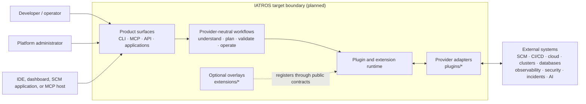
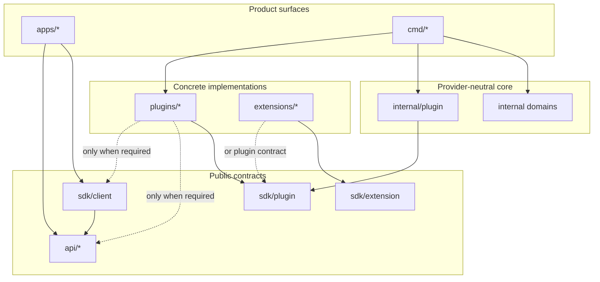
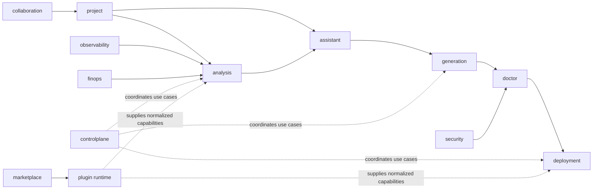
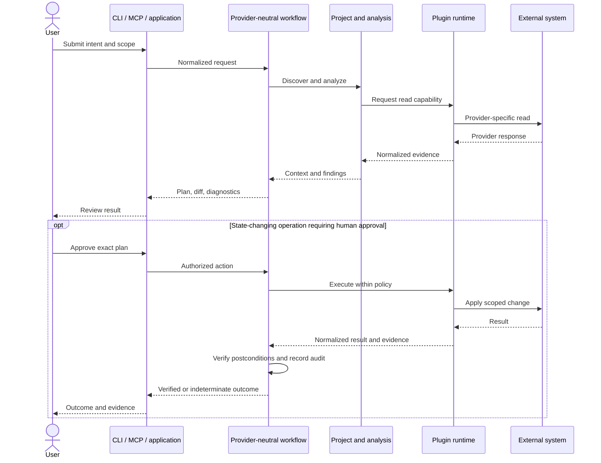

# IATROS Target Architecture

> [!IMPORTANT]
> **Status: target architecture with an integrated local analysis slice.** The root Go module and Cobra CLI expose bounded ignore-aware analysis and a separate bounded repository-topology workflow. Both use unified `small` or `monorepo` resource profiles and produce deterministic schema `0.3` text and JSON. A validated Enterprise per-worker profile exists for entitlement-aware composition. Every broader runtime, API, SDK, plugin, workflow, and security capability remains target behavior unless explicitly marked otherwise.

Related documents:

- [IATROS Product Contract](../product/product-contract.md)
- [Security architecture](security.md)
- [Testing strategy](testing.md)
- [Technology detection architecture](detection.md)
- [Project and workspace boundary model](project-model.md)
- [Manifest analysis architecture](manifest-analysis.md)
- [Repository topology architecture](topology.md)
- [Repository discovery architecture](repository-discovery.md)
- [Scaling profiles](scaling-profiles.md)
- [Repository readiness architecture](readiness.md)
- [Architecture decision records](decisions/README.md)

## 1. Status and scope

The repository contains the canonical directory scaffold, project metadata, branding, documentation, one root Go module, and tested `iatros analyze` and `iatros topology` workflows. The first command integrates bounded root and nested ignore rules, submodule isolation, metadata discovery, broad marker detection, five conservative readiness rules, discovery diagnostics, and semantically equivalent text and JSON output. The second detects nested boundaries, parses allowlisted manifests, resolves workspace membership, identifies direct local dependency edges, and maps them to its own versioned CLI report. One validated scaling selection configures both complete pipelines. The repository does not yet contain network API schemas, deployment configuration, CI workflows, or releases.

This document establishes:

- the intended system boundary and product surfaces;
- provider-neutral domain ownership;
- public contract and integration boundaries;
- allowed dependency direction;
- planned runtime responsibilities;
- conceptual workflows and safety properties;
- architecture invariants and non-goals;
- decisions that remain open.

It deliberately does not choose concrete vendors, protocols, storage engines, queues, sandbox technologies, or deployment topology.

## 2. Goals

IATROS aims to provide a deterministic DevOps control layer with optional AI assistance that can eventually:

- understand repositories and their operational topology;
- produce evidence-based plans, findings, and candidate artifacts;
- validate delivery and infrastructure changes before execution;
- coordinate explicitly authorized operations;
- support diagnosis, observability, security, and cost-awareness workflows;
- integrate external systems without coupling the core to particular vendors.

The architecture optimizes for safety, explainability, replaceable integrations, testability, and gradual evolution from a single repository.

## 3. System context

The diagram is a target context view. Every component inside the IATROS boundary is planned.

External repositories, provider responses, plugin output, and model output are data sources, not trusted authority. They cannot expand permissions or bypass policy.

Plan selection changes composition and permitted boundaries, not core semantics:

- Basic runs the core locally without AI or a required IATROS-hosted service; an installed open plugin may access only its declared destination for an explicit request.
- Pro adds an explicit cloud AI boundary and sends only selected, minimized project context under the applicable data controls.
- Enterprise adds a choice of cloud or company-controlled local AI and may load entitled closed plugins from private distribution channels.

AI placement does not move authorization into the model. Open and closed plugins remain outside the core trust boundary and receive only task-scoped capabilities. The canonical product rules are defined in the [IATROS Product Contract](../product/product-contract.md#33-boundary-by-plan).

Paid subscription entitlement is also outside provider-neutral domain behavior. Composition and admission layers expose a capability as available or unavailable; they do not teach core use cases about pricing or billing providers. Free Basic requires no paid entitlement. Pro or Enterprise downgrade and expiry return the product to Basic without deleting local artifacts or lifecycle evidence and without abandoning an already-started external effect before a safe terminal outcome.

## 4. Architectural principles and invariants

### Established

1. **One provider-neutral core.** Free Basic uses the core without AI or paid-entitlement dependencies. Pro cloud AI and Enterprise local-AI and closed-plugin capabilities extend the same core instead of copying it into subscription-specific trees.
2. **Provider-neutral domains.** `internal/<capability>` is reserved for product logic; concrete vendors belong under `plugins/`.
3. **Thin composition roots.** `cmd/*` wires applications and runtime dependencies but does not contain business logic.
4. **Stable public boundaries.** `api/` is reserved for public wire contracts and `sdk/` for public client, plugin, extension, and test contracts.
5. **No private imports from public packages.** `api/` and `sdk/` must not import `internal/`.
6. **No implementation inversion.** Core domains must not import concrete plugins or optional extensions; plugins and extensions must not import `internal/`.
7. **Consumer-owned interfaces.** Internal interfaces remain close to the domain that consumes them. Do not create global `common`, `shared`, `interfaces`, `models`, `services`, `repositories`, `helpers`, or `utils` dumping grounds.
8. **Acyclic internal dependencies.** Cross-domain dependencies must follow use cases, remain minimal, and avoid cycles.
9. **No speculative hierarchy.** Add vendor, version, transport, or deployment-specific packages only when real implementation requires them.
10. **One initial Go module.** First-party Go packages share `github.com/kVinsom/Iatros` until an independently released component justifies a split.
11. **Isolated CLI framework.** Cobra remains inside the CLI adapter; provider-neutral analysis and domain packages do not depend on it.
12. **Scalable profiles and replaceable backends.** The implemented `small`, `monorepo`, and Enterprise per-worker profiles configure the complete local pipeline through validated file, count, retained-value, and time budgets. Parser and processing implementations may be replaced behind consumer-owned interfaces when measured requirements justify a standard-library, third-party, generated, or streaming backend. See [Scaling profiles](scaling-profiles.md).

These established constraints are recorded in [ADR-0001](decisions/0001-capability-boundaries-and-dependency-direction.md), [ADR-0002](decisions/0002-single-core-with-optional-subscriptions.md), [ADR-0003](decisions/0003-start-with-one-go-module.md), [ADR-0005](decisions/0005-use-cobra-as-the-cli-adapter.md), and [ADR-0006](decisions/0006-version-private-core-contracts.md).

### Proposed

- Route state-changing operations through a policy-enforced `plan → validate → policy decision → approval when required → apply → verify` flow. See [ADR-0004](decisions/0004-control-state-changing-operations.md).

## 5. Logical component model

| Area | Target responsibility | Boundary |
| --- | --- | --- |
| `apps/*` | Dashboard, source-control, and IDE clients. | Consume public interfaces; no duplicate core logic. |
| `cmd/*` | Backend executable composition roots. | Wire concrete dependencies; remain thin. |
| `api/*` | Public wire contracts. | No service implementation and no imports from `internal`. |
| `sdk/client` | Public client contract and implementation surface. | Depends only on public contracts. |
| `sdk/plugin` | Stable capability contract for provider adapters. | Must not expose private core packages. |
| `sdk/extension` | Stable contract for optional product overlays. | Basic remains usable without Pro or Enterprise extensions. |
| `sdk/plugintest` | Plugin conformance and testing toolkit. | Tests public behavior, not private implementation. |
| `internal/*` | Provider-neutral application and domain logic. | Cannot import concrete plugins or extensions. |
| `plugins/*` | Open first-party external-system adapters. | Depend on public IATROS SDK/API contracts; may use the external SDK of the provider they adapt. |
| `extensions/*` | Optional Pro and Enterprise product overlays. | Implement public contracts; no copied core and no requirement to store customer-specific closed plugin source in the public repository. |
| `deploy/*` | Deployment resources for IATROS. | Not generated customer-project infrastructure. |
| `test/*` | Cross-component integration and end-to-end tests. | Package tests remain next to packages. |

## 6. Dependency direction

Arrows represent allowed compile-time knowledge, not runtime data flow.

Concrete backend wiring belongs in `cmd/*`. Boundary adapters translate between public contracts and internal domain types without exposing private packages.

How optional extensions are discovered and composed remains TBD. Basic composition cannot require `extensions/*`; extensions register only through public extension or plugin contracts.

An inbound API adapter is wired by the applicable composition root, such as `cmd/controlplane` or `cmd/iatros`, but its implementation does not live in `cmd/*`. It translates `api/*` wire messages into internal use cases. The boundary-owning package, server package, protocol, and transport remain TBD.

## 7. Domain map

The following paths define capability ownership. Analysis orchestration, discovery, technology detection, project-boundary modeling, manifest analysis, topology association, readiness, and CLI reporting have initial implementations; other entries remain structural or target boundaries unless documented otherwise.

| Domain | Target responsibility |
| --- | --- |
| `internal/project` | Provider-neutral project and workspace boundary model consumed by topology analysis. |
| `internal/manifest` | Bounded, provider-neutral manifest parsing, normalization, resource profiles, and replaceable parser contracts. |
| `internal/topology` | Deterministic project/component association, workspace relationships, and direct local dependency resolution. |
| `internal/analysis` | Unified scaling profiles, bounded discovery, analysis orchestration, topology analysis, and versioned CLI report contracts. |
| `internal/detection` | Evidence-based identification of languages, runtimes, dependency managers, and DevOps tooling. |
| `internal/readiness` | Deterministic repository-readiness rules and private findings. |
| `internal/assistant` | Provider-neutral planning, context assembly, risk reasoning, and root-cause-analysis coordination. |
| `internal/generation` | Creation of candidate delivery, infrastructure, documentation, and operational artifacts. |
| `internal/doctor` | Validation and actionable diagnostics. |
| `internal/deployment` | Promotion, rollback, GitOps, reconciliation, and drift workflows. |
| `internal/observability` | Provider-neutral telemetry semantics and reliability workflows. |
| `internal/security` | Provider-neutral security policy, normalized findings, and effect classification. |
| `internal/finops` | Provider-neutral cost and resource analysis. |
| `internal/collaboration` | Shared workflow and project-collaboration semantics. |
| `internal/controlplane` | Request coordination, policy checkpoints, and workflow orchestration. |
| `internal/plugin` | Capability discovery, compatibility, invocation, and plugin lifecycle. |
| `internal/marketplace` | Plugin catalog metadata and discovery. |

The diagram is illustrative and non-exhaustive. It shows possible conceptual information flow, not a mandatory pipeline or a prescription for Go imports.

## 8. Plugin capability map

Plugin directories group adapters by capability rather than committing to specific vendors.

| Category | Intended adapter scope |
| --- | --- |
| `plugins/ai` | AI model and inference providers. |
| `plugins/cloud` | Cloud platforms and cloud-specific inventory, cost, and operations. |
| `plugins/communication` | Human communication and notification tools. |
| `plugins/containers` | Container engines, registries, and orchestration platforms. |
| `plugins/corporate` | Business and organizational systems; exact scope remains TBD. |
| `plugins/databases` | Database platforms and operational interfaces. |
| `plugins/delivery` | Build, CI/CD, release, and delivery systems. |
| `plugins/incidents` | Incident-management and on-call systems. |
| `plugins/infrastructure` | Infrastructure definition and provisioning tools. |
| `plugins/languages` | Language and ecosystem-specific project analysis. |
| `plugins/messaging` | Machine-to-machine messaging systems. |
| `plugins/observability` | Metrics, logs, traces, and operational backends. |
| `plugins/security` | Security scanners, policy providers, and vulnerability sources. |
| `plugins/sourcecontrol` | Source-control platforms and repository operations. |

Adding a provider requires an implemented contract and use case; the scaffold must not grow one empty directory per possible vendor.

`apps/github` and `apps/gitlab` are inbound product surfaces for users, installation events, and platform callbacks. `plugins/sourcecontrol` contains outbound provider adapters that expose normalized source-control capabilities. Applications consume public interfaces; they do not duplicate provider integration logic.

## 9. Planned runtime roles

These are logical responsibilities, not a commitment to five independently deployed services.

| Entry point | Target responsibility | Open choices |
| --- | --- | --- |
| `cmd/iatros` | Implemented human-facing CLI composition root. It exposes help, version, local readiness analysis, and repository topology. | Whether later workflows remain embedded or use a control plane. |
| `cmd/mcp` | Model Context Protocol adapter for MCP hosts. | Transport, authentication, and exposed capabilities. |
| `cmd/controlplane` | Request admission, policy checks, coordination, and workflow metadata. | API protocol, persistence, tenancy, and deployment topology. |
| `cmd/worker` | Asynchronous or long-running workflow execution. | Queue, scheduling, retries, leases, and whether it is needed for the first release. |
| `cmd/agent` | Least-privileged execution near a host or cluster when local connectivity is required. | Trust bootstrap, isolation, connectivity, updates, and secret delivery. |

`apps/dashboard`, `apps/github`, `apps/gitlab`, and `apps/ide` are planned clients of public interfaces, not alternative implementations of the core.

## 10. Conceptual workflows

The [IATROS Product Contract](../product/product-contract.md) is authoritative for the Analyze → Plan → Generate → Validate → Deploy → Monitor → Fix lifecycle and subscription responsibilities. The following workflows describe how the target architecture may realize that contract.

1. **Inspect or advise:** Analyze, optionally followed by Plan, returns evidence and recommendations without target mutation.
2. **Prepare:** Analyze → Plan → Generate → Validate returns exact candidate artifacts, diffs, provenance, and diagnostics.
3. **Change:** Prepare → Deploy → Monitor applies an explicitly authorized candidate and verifies its postcondition.
4. **Operate:** Monitor → Fix → Analyze → Plan converts an operational signal into fresh evidence and a remediation proposal.
5. **Validate an external candidate:** Validate → Deploy → Monitor accepts a candidate only through normalized provenance and the same execution gates.
6. **Reconcile:** Analyze → Plan → Generate when needed → Validate → Deploy → Monitor drives an indeterminate or drifted target toward an explicit verified postcondition.
7. **Plugin lifecycle:** capability metadata → compatibility and trust checks → registration → invocation through SDK contracts → normalized result.

Stage results are immutable. Changed evidence, scope, plan, candidate, validation, policy, approval, capability, or target state creates a new result and invalidates every affected downstream gate. The runtime representation may differ between immediate local workflows and durable distributed workflows, but terminal-outcome meanings remain identical.

The target interaction keeps planning separate from state-changing authority. The sequence below illustrates a case in which policy requires human approval; a future non-interactive workflow must satisfy equivalent pre-authorized policy controls.

The approval and execution semantics remain proposed until [ADR-0004](decisions/0004-control-state-changing-operations.md) is accepted.

## 11. Data and contract ownership

| Concept | Intended owner | Notes |
| --- | --- | --- |
| Canonical project model | `internal/project` | Private, provider-neutral representation; schema is TBD. |
| Normalized manifest facts | `internal/manifest` | Private direct declarations mapped through the topology report contract. |
| Repository discovery | `internal/analysis` and `internal/repositoryignore` | Bounded local inventory, Git-style ignore rules, large-file controls, and nested-repository isolation. |
| Repository topology | `internal/topology` and `internal/analysis` | Private associated model plus versioned CLI schema `0.3`; no network API contract yet. |
| Evidence and findings | Consuming internal domains | Interfaces and types remain near consumers. |
| Plans and candidate artifacts | `internal/assistant` and `internal/generation` | Not executable authority by themselves. |
| Validation results | `internal/doctor` | Normalized diagnostics with provenance. |
| Public wire messages | `api/` | Versioning and transport are TBD. |
| Client contract | `sdk/client` | Must remain independent from private packages. |
| Plugin capabilities | `sdk/plugin` | Concrete providers translate to normalized contracts. |
| Optional product capabilities | `sdk/extension` | Pro and Enterprise extensions remain optional to Basic. |
| Audit evidence | Security/control-plane boundary | Storage and event schema are TBD. |

The private contract rules are defined in [PS-0002](../product/0002-core-domain-contracts.md) and [ADR-0006](decisions/0006-version-private-core-contracts.md). Internal JSON field names support deterministic private persistence and tests; they are not a released public wire format. Public contract publication creates separate compatibility obligations. Until a public contract has a concrete consumer and approved specification, the architecture must not invent versioned API or SDK packages or expose `internal/` types directly.

## 12. Trust boundaries and target safety properties

The detailed model is in [Security architecture](security.md). The minimum target properties are:

- repository content, external responses, generated content, plugin output, and model output are untrusted input;
- generated artifacts remain candidates until validated and reviewed;
- state-changing operations cross an explicit policy and authorization boundary;
- workers, agents, plugins, and extensions receive least-privileged, task-scoped capabilities;
- credentials do not enter logs, artifacts, audit payloads, or model context by default;
- external effects carry actor, scope, target, policy, approval, provenance, and outcome evidence;
- indeterminate outcomes fail closed and require reconciliation rather than being reported as success.

Exact identity, policy, sandbox, secrets, audit-storage, and approval mechanisms remain TBD.

## 13. Quality attributes

| Attribute | Architectural response |
| --- | --- |
| Safety | Separate proposals from effects; validate scope; enforce policy outside AI and plugins. |
| Explainability | Preserve evidence, findings, diffs, decisions, and provenance. |
| Portability | Keep provider-neutral behavior in the core and vendors behind contracts. |
| Evolvability | Use capability boundaries and ADRs; avoid speculative abstractions and module splits. |
| Reliability | Design effectful work for idempotency, cancellation, retries, verification, and partial failure. |
| Operability | Plan structured telemetry, correlation, health signals, and actionable failure states. |
| Testability | Test packages locally, contracts at boundaries, and complete workflows separately. |
| Security | Apply least privilege, data minimization, secret isolation, and tamper-evident audit. |

See [Testing strategy](testing.md) for the target verification model.

## 14. Non-goals

- Claiming target capabilities as runnable before source and tests prove them.
- Duplicating the provider-neutral core for Pro or Enterprise subscriptions.
- Putting vendor-specific code in `internal/`.
- Choosing vendors, API versions, queues, databases, RPC, deployment topology, or plugin process model before requirements exist.
- Turning every `cmd/` directory into a mandatory standalone service.
- Starting with multiple Go modules without an independent release requirement.
- Creating global utility or shared-model layers.
- Treating `deploy/` as generated infrastructure for customer projects.
- Allowing irreversible changes without a separate authorization and policy decision.

## 15. Open decisions

The following choices remain intentionally unresolved:

- which remote workflows require a control plane after the local Basic MVP and when that boundary is introduced;
- API transport, wire format, and versioning;
- workflow persistence, queues, retries, idempotency, cancellation, and recovery;
- distributed Enterprise admission, worker classes, concurrency, autoscaling, isolation, and capacity planning beyond the implemented per-worker profile;
- authentication, authorization, resource hierarchy, tenancy, and audit model;
- plugin process isolation, capability negotiation, signing, distribution, revocation, and compatibility;
- agent trust bootstrap, sandboxing, network policy, updates, and secret delivery;
- approval, dry-run, policy, rollback, and break-glass semantics;
- AI provider abstraction, permitted data classes, retention, provenance, evaluation, and cost controls;
- translation and independent versioning between private core contracts and future public wire contracts;
- artifact storage, integrity, provenance, and retention;
- telemetry contracts, service-level objectives, and disaster-recovery targets;
- Pro AI and private Enterprise registration, packaging, licensing, and distribution;
- criteria for independent SDK or plugin release lifecycles.

Each consequential choice should become an ADR only when requirements and alternatives are concrete.

## 16. Architecture review checklist

A change that affects architecture should answer:

- Which capability owns the behavior?
- Is the dependency direction allowed?
- Does provider-specific logic remain outside the core?
- Is a public contract actually required?
- Can Basic build and operate without Pro, Enterprise, AI, or closed plugins?
- Are untrusted input and effect boundaries explicit?
- What evidence, validation, and audit data are required?
- Which unit, contract, integration, security, or end-to-end tests prove the behavior?
- Does the change resolve a TBD or alter an accepted decision?
- Does it require a new or superseding ADR?

## 17. Glossary

| Term | Meaning |
| --- | --- |
| **Capability** | A normalized operation exposed through a stable boundary. |
| **Candidate artifact** | Generated content that has not yet been validated and authorized for use. |
| **Basic** | The free local plan with deterministic DevOps architecture generation, no AI, and open plugin development. |
| **Pro** | The paid individual plan that includes Basic and adds cloud AI while retaining open plugins. |
| **Enterprise** | The paid company plan that includes Pro and adds cloud or local AI and closed private plugins. |
| **IATROS core** | The single provider-neutral base used by Basic, Pro, and Enterprise without subscription-specific forks. |
| **Entitlement** | An integrity-protected assertion that makes a Pro or Enterprise capability available; it is not target authorization. |
| **Effect** | An operation that can change repository, infrastructure, provider, or product state. |
| **Extension** | An optional product capability implemented through public extension or plugin contracts. |
| **Open plugin** | A publicly distributable plugin available for creation and use in every plan. |
| **Closed plugin** | An Enterprise-only plugin distributed privately to authorized company environments. |
| **Plugin** | A concrete external-system adapter behind a stable capability contract. |
| **Product surface** | A CLI, API, application, or protocol adapter through which a user or system interacts with IATROS. |
| **Project model** | The canonical provider-neutral representation of a repository and its operational topology. |
| **Schema version** | A canonical `major.minor` identity used to select compatibility or an explicit migration for persisted contract data. |
| **Workflow result** | An immutable terminal-stage envelope containing identity, outcome, time, artifact references, diagnostics, and feature-owned data. |
