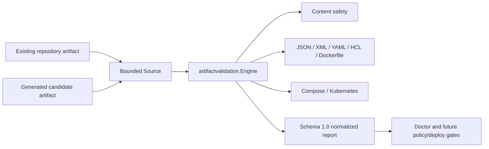

# Artifact Validation Architecture

> **Status: core engine and built-in local validators implemented; workflow and CLI adapters pending.**

See also:

- [PS-0010: Doctor and Artifact Validation Contract](../product/0010-doctor-validation-contract.md)
- [Doctor architecture](doctor.md)
- [Security architecture](security.md)
- [Scaling profiles](scaling-profiles.md)

## 1. Ownership and boundary

`internal/artifactvalidation` owns artifact descriptors, bounded content sources, validator registration, normalized
diagnostics, result validation, and resource profiles. It does not own generation, plans, deployment authorization,
provider credentials, external tool execution, or public wire contracts.

An artifact kind describes operational purpose; format describes serialization. Keeping them separate permits, for
example, Kubernetes JSON and YAML or Terraform HCL and JSON without duplicating validation contracts.

## 2. Source ownership

The consumer supplies a `Source` that opens a fresh `io.ReadCloser`. The engine owns and closes that reader. It reads
at most the smaller remaining per-artifact and total byte budget plus one sentinel byte, so oversize detection does
not require reading the complete input.

`MemorySource` copies input bytes at construction and supports generated or preloaded content without exposing
mutable caller storage. `DirectorySource` owns one `os.Root`, accepts only safe repository-relative file paths,
rejects links, verifies stable regular-file identity before and after open, and accepts only regular files. A later
effectful workflow still requires the broader process, identity, and authorization controls for execution.

The report retains size and `sha256:<lowercase hex>` digest, never content. Source open, read, and close failures are
normalized without copying underlying error text.

## 3. Validator boundary

Validators are registered explicitly in the composition root, sorted by stable dotted ID, and rejected when IDs
duplicate. Each receives cancellation, a repeatable read-only document reader, and the active limits. The interface
belongs to the consuming package; no global registry or side-effecting `init` registration exists.

The built-in set contains content, syntax, and limited provider-neutral structure validation. Shape validators do
not duplicate syntax errors: if parsing fails, the syntax validator remains the diagnostic owner. Parser libraries
never read paths themselves and therefore cannot expand repository scope.

Specialized backends may add JSON Schema, OpenAPI, Kubernetes schema, policy-as-code, provider validation, or a
controlled dry run. Such adapters must preserve the same artifact digest, diagnostic shape, cancellation, byte and
result limits, deterministic behavior, and no-secret rules. External execution is a separate capability boundary,
not a hidden behavior of a parser.

## 4. Result semantics

Artifact outcome is `valid`, `warning`, `invalid`, or `unavailable`. Report status is derived:

- any unavailable or truncated work yields `partial`;
- otherwise any invalid artifact yields `failed`;
- otherwise warnings yield `passed_with_warnings`;
- otherwise the report is `passed`.

Every diagnostic identifies its artifact, path, validator ID and version. A custom validator cannot spoof those
fields because the engine overwrites them from the validated descriptor. Invalid custom diagnostic codes, levels,
locations, or messages are replaced by a safe engine-owned diagnostic.

Normalization clones collections and sorts artifacts, validators, and diagnostics. Validation rejects unknown
enums, unsafe paths, malformed digests and locations, duplicate identities, incompatible kind-format pairs, and
status/outcome mismatches.

## 5. Parser safety

- JSON uses streaming tokens and rejects incomplete or multiple top-level values.
- XML uses strict streaming tokens, requires one root, and rejects directives and non-declaration processing
  instructions in the safe profile.
- YAML parses documents into bounded trees, then checks depth, node count, aliases, and duplicate scalar keys.
- HCL uses `hclsyntax.ParseConfig` on already bounded bytes and converts ranges into normalized locations.
- Dockerfile validation is deliberately conservative. It validates logical instructions, line continuations,
  instruction placement, and the first `FROM`; unknown future instructions are warnings rather than false hard
  failures.

Content byte limits remain the first defense for parsers that allocate an AST. Node, token, depth, alias,
diagnostic, and time limits provide independent bounds where the parser API exposes them.

The parser selection and replacement constraints are recorded in
[ADR-0008](decisions/0008-use-bounded-replaceable-artifact-parsers.md).

## 6. Scaling

Artifact validation is part of the unified analysis profile. The profile validates that artifact byte budgets do
not exceed the corresponding DevOps configuration budgets. It does not allocate maximum capacity in advance;
storage grows only with observed bounded content and retained results.
