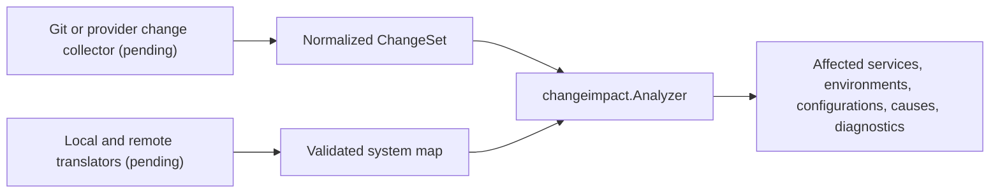

# Change Impact Analysis Architecture

> **Status: core analyzer implemented.** Change collection, system-map translators, and product-surface adapters remain pending.

See also:

- [PS-0008: Change Impact Analysis Contract](../product/0008-change-impact-analysis-contract.md)
- [System map architecture](system-map.md)
- [Unified findings architecture](findings.md)
- [Scaling profiles](scaling-profiles.md)

## 1. Ownership and dependency direction

`internal/changeimpact` owns provider-neutral change and impact models, validation, normalization, resource limits,
and graph analysis. It consumes `internal/systemmap`; the system map does not depend on change impact. Source-control
collectors belong in source-control adapters and translate provider or Git representations at the boundary.

This direction keeps the graph algorithm independent from Git libraries, HTTP SDKs, CLI frameworks, credentials,
and future storage choices.

## 2. Indexing and direct matching

The analyzer builds per-invocation indexes for entity roots, exact evidence locations, reverse dependency edges,
entity-to-environment associations, and result lookups. Changed files are matched by exact evidence first and then
by walking their ancestor directories to mapped roots. Work is proportional to the changed path depth rather than
scanning every entity for every change.

Indexes are local immutable analysis state. They are not a cross-request cache and do not outlive the system map;
future durable caches need explicit version identity, invalidation, tenancy, and memory ownership.

## 3. Dependency traversal

System-map relationships point from a consumer or workload to the target it uses. Impact therefore traverses a
reverse index: a changed target reaches its consumers. Only normalized dependency-like relationship kinds are
admitted. Traversal state includes entity, change ID, and changed path, which terminates cycles while preserving
independent attribution for distinct changes and both sides of a rename.

The analyzer retains an ordered relationship chain in each cause. It does not infer source symbols, runtime calls,
or provider semantics not represented in the map.

## 4. Result construction

Per-target accumulators deduplicate causes and promote impact strength in place. Direct impact cannot be downgraded
by a later dependency path. Environments are recorded directly from evidence or as associations of impacted
services, configurations, and relationship environments. Final map iteration is normalized before validation, so
runtime map order never affects serialized results.

## 5. Resource behavior

The active profile bounds inputs, direct entity matches, retained collections, graph depth, total edge traversals, causes per target,
relationship IDs per cause, diagnostics, text, and elapsed time. Collections allocate only for encountered data;
the implementation does not reserve profile maxima.

Retention and traversal limits create one bounded warning per limit kind and mark the result partial. Informational
unmapped-change diagnostics may be replaced by a limiting warning if the diagnostic budget is already full, so a
partial result always retains an explanation. Cancellation aborts rather than returning a misleading partial model.

## 6. Extension rules

- Add relationship semantics to the allowlist only with direction and cycle tests.
- Keep language-aware symbol analysis behind a separate consumer-owned boundary; project symbol models into file or
  entity impact rather than importing parsers into this package.
- Keep collectors replaceable and make them preserve stable change IDs, repository identity, rename pairs,
  cancellation, safe paths, and bounded input.
- Do not use an unsupported relationship as a weak heuristic. Ambiguity must remain diagnostic or finding evidence.
