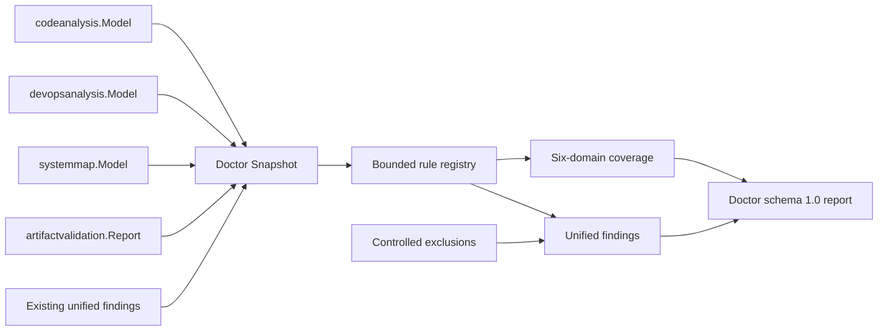

# IATROS Doctor Architecture

> **Status: schema 1.0 report, bounded auditor, six-domain coverage, built-in rules, and finding exclusions implemented; CLI and lifecycle orchestration pending.**

See also:

- [PS-0010: Doctor and Artifact Validation Contract](../product/0010-doctor-validation-contract.md)
- [Artifact validation architecture](artifact-validation.md)
- [Unified findings architecture](findings.md)
- [DevOps stack analysis architecture](devops-analysis.md)
- [System map architecture](system-map.md)

## 1. Responsibility

`internal/doctor` assesses operational readiness from normalized facts. It owns audit categories, rule registration,
evidence availability, category coverage, built-in operational rules, and the Doctor report. It consumes but does
not redefine static-code, DevOps, system-map, artifact-validation, or finding contracts.

Doctor is a query. It has no filesystem, network, provider, deployment, billing, or runtime-observation authority.
Adapters obtain facts at their own boundary and translate them into the normalized snapshot.

## 2. Evidence completeness

Each rule declares required input sets and whether it requires complete evidence. Inputs have three internal states:

- complete: the normalized model or report is valid and non-partial;
- partial: the producer explicitly reported incomplete work; or
- unavailable: the snapshot does not contain that input.

An absence rule is skipped unless every required input is complete. A positive-evidence rule may run on partial
input, but its category coverage remains partial. This prevents omitted files, truncated providers, failed parsers,
or absent analyzers from becoming false absence findings.

Every category is `evaluated`, `partial`, or `not_evaluated`. Coverage counts registered rules, so `evaluated` means
the configured catalog ran successfully. It does not claim that static local evidence replaces live reliability,
load, vulnerability, policy, billing, or provider checks.

## 3. Rule registration and output

Rules have stable ID, version, category, input requirements, and a cancellation-aware evaluation method. The
auditor sorts rules and rejects nil, malformed, duplicate, excessive, or category-incomplete registrations. Every
configured auditor must contain at least one rule for all six categories.

Each evaluation receives the remaining finding budget. Built-in rules stop before constructing results beyond that
budget, and the auditor rejects an excessive custom result before cloning or normalizing it. Reaching the budget is
an explicit partial result rather than silent truncation.

Malformed or excessive custom output and operational rule errors are isolated as diagnostics. Underlying error text
is not exposed. A failed rule makes its category partial; it cannot silently disappear or convert the report to
ready.

Rules return the shared `internal/finding` model. The auditor requires active, unexcluded findings whose rule ID
matches the producing descriptor, rejects duplicate finding IDs, applies time-bounded exclusions once, and retains
excluded findings for auditability.

## 4. Built-in catalog

The first catalog covers evidence currently present in normalized local models:

| Category | Checks |
| --- | --- |
| Production | Explicit production environment; ownership for production services. |
| Reliability | Observability resources; alert signals. |
| Performance | Immutable or controlled container image tags instead of implicit or `latest` references. |
| Security | Blocking delivery controls; defaults on sensitive environment variables. |
| Deployment | CI/CD pipeline; GitOps for detected Kubernetes; failed artifact validation. |
| Cost | Infrastructure environment assignment; declarative infrastructure evidence. |

Future runtime, cloud, security-scanner, FinOps, SLO, load-test, policy, and deployment-provider rules plug into the
same registry. They must declare evidence requirements rather than interpreting missing adapters as successful
checks.

## 5. Status derivation

Doctor status is derived after exclusions:

- any incomplete category yields `partial`;
- otherwise an active high or critical finding yields `not_ready`;
- otherwise any active finding yields `attention_required`;
- otherwise the report is `ready`.

This status is readiness evidence, not deployment authorization. A future Deploy stage must bind the exact plan,
artifact digests, target state, policy decision, approval, and validation result independently.

## 6. Resource model

Doctor limits rules, normalized input facts, inherited repository findings, diagnostics, text, and audit time. The
unified scaling profile verifies that Doctor can retain the configured code, DevOps, system-map, artifact-validation,
and finding maxima for one worker. Collections are cloned and sorted without mutating caller-owned models; maximum
profile capacity is not preallocated. Artifact validators similarly retain at most one result beyond their local
diagnostic budget so the engine can emit an explicit truncation diagnostic without copying unbounded custom output.
