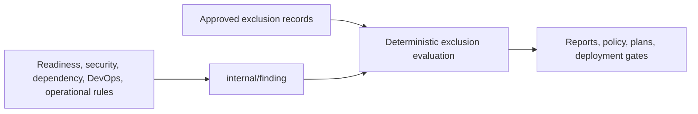

# Unified Findings Architecture

> **Status: normalized model and controlled exclusions implemented; readiness, Doctor, and local analysis reporting migrated.** Other analyzers must adopt the contract when they begin producing findings.

See also:

- [PS-0009: Unified Findings Contract](../product/0009-unified-findings-contract.md)
- [Repository readiness architecture](readiness.md)
- [Security architecture](security.md)
- [Scaling profiles](scaling-profiles.md)

## 1. Ownership

`internal/finding` owns the provider-neutral finding vocabulary, nested evidence and assessment records, validation,
normalization, limit profiles, and deterministic exclusion evaluation. Rule-owning capabilities construct findings;
they do not duplicate the model. The package has no dependency on CLI, HTTP, persistence, a policy engine, provider
SDKs, or a process clock.

## 2. Finding identity and assessment

Finding ID identifies one emitted problem; rule ID identifies the rule contract. Both are stable lowercase dotted
identifiers. A finding also contains human-readable title and description, affected normalized subjects, evidence,
producer and rule versions, severity, confidence, risk, recommendation, and disposition.

Assessment dimensions stay separate:

- severity expresses urgency and consequence;
- confidence expresses evidentiary certainty;
- risk level and likelihood express the assessed adverse outcome; and
- recommendation expresses the desired remediation outcome and concrete actions.

Consumers may define policy thresholds over these fields, but the core model does not silently derive one from
another.

## 3. Evidence boundary

Evidence is a discriminated representation:

- repository-file evidence requires repository identity and a safe relative path;
- an optional source location is either entirely absent or a complete non-reversed range;
- analyzer observations contain only a description;
- runtime and external observations require sanitized references and cannot masquerade as repository paths.

Evidence supports a conclusion but is not automatically an authorization to read the source again. Adapters retain
only the evidence permitted by the active scope and privacy policy.

## 4. Controlled exclusion evaluation

`ApplyExclusions` takes findings, exclusion records, an explicit UTC evaluation time, and limits. It validates active
input findings, sorts records, rejects duplicate exclusion IDs, indexes exact and rule targets once, selects the highest-ranked active match, attaches a
detached applied-decision record, and validates the complete output model.

Match precedence is exact finding target before rule target, then number of populated scope selectors, then stable
exclusion ID. Scope selectors are conjunctive. Repository selection may match a subject or repository evidence;
environment and subject selectors match subjects; path prefixes match repository evidence at path boundaries.

The result retains all considered exclusion records, including expired and mismatched records. A finding remains
present after exclusion. Policy consumers can therefore distinguish active, excluded, expired, and never-matched
problems without reconstructing hidden state.

## 5. Resource and ownership rules

All built-in profiles bound findings, subjects, evidence, actions, exclusion records, text, and execution time.
Normalization clones every mutable nested collection and applied exclusion pointer. No caller-owned input is sorted
or mutated. Limits reject oversized input; they do not silently truncate evidence or audit decisions.

## 6. Integration

`internal/readiness.Finding` is an alias of the unified type. Readiness owns its rules and fixed recommendations,
while `internal/finding` owns representation. `internal/analysis.Report` uses the same type directly, so there is no
lossy readiness-to-report translation. The analysis report schema is `1.0`; text output renders assessment,
evidence, risk, recommendation, disposition, and any applied exclusion.

`internal/doctor` also emits this type directly for production, reliability, performance, security, deployment,
and cost rules. Doctor validates active rule output, rejects duplicate identities, and applies the same controlled
exclusions once after every registered rule finishes.

Operational diagnostics remain separate report records. They describe execution state and partial analysis, not a
confirmed product problem, and cannot be suppressed through finding exclusions.

## 7. Future adapters

External scanner adapters must normalize vendor severities, confidence, evidence, references, and remediation into
this model at the boundary. A mapping must be explicit and tested; unknown values cannot be passed through as new
core enum strings. Persistence and public API schemas may use separate representations but must preserve every
required dimension and exclusion audit property.
