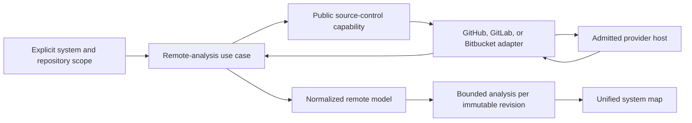

# IATROS Remote and Polyrepository Analysis Architecture

> **Status: normalized contract implemented; provider adapters, content acquisition, and product-surface integration are pending.**

See also:

- [Remote and polyrepository product contract](../product/0007-remote-polyrepo-analysis-contract.md)
- [System map architecture](system-map.md)
- [Security architecture](security.md)
- [Scaling profiles](scaling-profiles.md)
- [Target architecture](README.md)

## 1. Capability boundary

`internal/remoteanalysis` owns the provider-neutral description of a remote multi-repository system. It knows
the three provider families required by the product but does not know their SDKs, authentication types, API
versions, pagination tokens, or wire payloads.

Concrete outbound adapters belong under `plugins/sourcecontrol`. A later composition root will connect an
enabled adapter to a remote-analysis use case. The intended dependency and data direction is:

The public source-control capability and use-case orchestration in this diagram are not implemented yet. The
current code establishes the normalized result and resource boundary that they must preserve.

## 2. Provider-neutral identity

A remote repository is identified by:

- a system-local repository ID;
- provider family: `github`, `gitlab`, or `bitbucket`;
- lowercase host with an optional explicit canonical port;
- lowercase namespace with support for nested GitLab groups;
- lowercase repository name;
- exact 40- or 64-character lowercase Git object identifier;
- selected branch, tag, default branch, or direct commit;
- optional default branch plus normalized visibility, fork, and archive metadata.

The contract deliberately does not store a clone URL. Adapters construct provider requests from independently
validated fields and resolve credentials through their execution boundary. This prevents credentials,
provider-specific URL forms, and redirect behavior from becoming core identity.

The tuple of provider, host, namespace, and repository name is unique within a system. A second repository ID
cannot alias the same physical provider location and inflate analysis work or create conflicting graph nodes.

## 3. Polyrepository graph

One model is one software system and contains one or more repositories plus directed repository relationships.
Both relationship endpoints must exist, self-relationships are rejected, and each relationship requires
evidence from an admitted repository. Relationship types use normalized identifiers so provider adapters and
catalog translators can add stable semantics without adding provider enums to the core.

The remote model is narrower than the unified system map. It records source composition and provenance, while
`internal/systemmap` owns services, libraries, infrastructure, environments, owners, external resources, and
cross-domain relationships. A later translator combines remote provenance with bounded per-repository analysis.

## 4. Host and reference safety

Host validation supports public domains, self-managed DNS names, IPv4, and bracketed IPv6, each with an optional
port. Brackets are reserved for IPv6 literals. Hosts must be lowercase and cannot contain a scheme, path, user
information, query, fragment, or backslash. Namespaces and repository names are lowercase safe path segments.

Git references reject control characters, escaping or ambiguous separators, lock suffixes, reflog syntax, and
characters forbidden by Git reference rules. They also reject symbolic `HEAD` and leading `-` so a later Git
adapter cannot reinterpret a reference as a symbolic selector or command-line option. Default-branch selection
must equal the recorded default branch; direct commit selection must equal the immutable revision.

Provider evidence is sanitized text, not a URL or raw payload. Repository-file evidence uses the shared safe
repository-relative path policy. A shared security validator rejects URL, user-information, query, fragment,
parameter, authorization-header, bearer, and basic credential forms. Repositories must have provider metadata
evidence that references only their own identity.

## 5. Adapter execution requirements

A future provider adapter must:

1. accept an explicit provider host and repository scope;
2. resolve credentials outside request, result, logs, cache keys, and diagnostics;
3. validate every redirect and refuse an unadmitted destination;
4. use bounded timeouts, pages, requests, concurrency, and response bodies;
5. pin a moving reference to one immutable revision before content analysis;
6. preserve cancellation and stop scheduling requests after cancellation or a terminal limit;
7. normalize provider errors without copying sensitive response content;
8. return partial state when an admitted repository or relationship cannot be resolved;
9. perform no write operation through the read-only analysis capability;
10. pass shared conformance tests across public and self-hosted provider variants.

Provider SDKs are optional implementation choices. An adapter may use a maintained SDK or bounded HTTP client
after license, maintenance, vulnerability, pagination, cancellation, response-size, redirect, and error-redaction
review. The choice cannot alter the normalized contract.

## 6. Resource profiles

Remote limits govern provider pages, page size, total requests, request concurrency, response and total bytes,
retained repositories, repository relationships, evidence, diagnostics, text, and stage duration. Page capacity
must be sufficient for the repository budget, and request capacity must cover admitted pages.

The unified system-map profile is validated to retain at least every permitted remote repository and
relationship and to preserve the remote evidence, diagnostic, and text limits. Network budgets do not enable
network access; adapter installation, destination policy, user intent, and credentials remain separate gates.

## 7. Deferred decisions

The following choices remain open until adapter implementation:

- public plugin request and response types;
- authentication mechanisms and secret-provider integration;
- REST, GraphQL, or provider SDK selection by adapter;
- archive download versus Git transport for immutable content;
- cache identity, encryption, expiry, and provider revocation behavior;
- retry and rate-limit scheduling;
- catalog formats and repository relationship precedence;
- CLI, API, application, and control-plane exposure.
