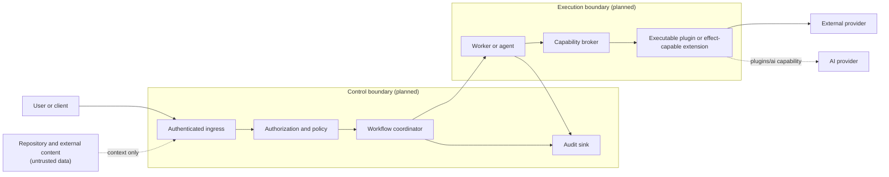

# IATROS Security Architecture

> [!IMPORTANT]
> **Status: proposed baseline with implemented local-analysis safeguards.** The current CLI validates and analyzes one local directory through a confined directory handle, rejects selected link targets and explicit Windows network or device paths, and exposes only a relative report root. `iatros analyze` performs bounded metadata-only traversal. `iatros topology` additionally performs allowlisted, byte-bounded manifest reads through the same confinement model. Neither workflow uses the network, executes commands, or writes to the target. All broader controls remain target requirements unless explicitly marked otherwise.

The internal discovery component retains one confined `os.Root`, skips link and irregular entries, streams directory entries in bounded chunks, caps retained paths and issues, and never opens regular files. Filesystem access failures become root-relative structured issues without exposing raw operating-system errors.

The internal technology detector consumes only the validated root-relative inventory. It sorts and deduplicates paths, bounds retained evidence, rejects unsafe evidence paths, honors cancellation, and does not read file content or execute detected package managers and infrastructure tools.

The internal readiness evaluator consumes only bounded inventory metadata and minimal technology identities. It suppresses every absence-based rule for partial discovery, validates evidence inputs, and produces fixed English remediation text without reading repository content or invoking detected tools.

The internal manifest analyzer opens only exact registered manifest filenames from the bounded inventory. It rejects unsafe paths, links, irregular files, unstable file identities, duplicate JSON keys, trailing JSON, XML directives and DTDs, multiple XML roots, excessive nesting, oversized content, and malformed backend output. It processes one bounded document at a time, redacts remote and local dependency references, and never exposes raw parser or operating-system errors in diagnostics. Parser backends have no filesystem or network capability beyond the supplied reader.

The internal topology builder performs no I/O. It resolves workspace declarations only against bounded known project roots, rejects repository escapes and unsupported pattern semantics, preserves ambiguous dependency candidates instead of selecting one, and bounds projects, workspaces, components, declarations, matches, dependencies, targets, values, duration, and diagnostics.

The topology CLI adapter validates the complete mapped report before rendering it. Malformed or unsafe internal output is replaced by a canonical failed report. Text and JSON expose no absolute target, timestamp, raw manifest content, or raw operating-system error, and all nested path collections remain repository-relative.

See also:

- [Target architecture](README.md)
- [Testing strategy](testing.md)
- [Manifest analysis architecture](manifest-analysis.md)
- [Repository topology architecture](topology.md)
- [ADR-0004: Control state-changing operations](decisions/0004-control-state-changing-operations.md)

## 1. Security objectives

IATROS is intended to process repositories, operational metadata, model output, credentials, and actions against external systems. Its security architecture must:

- prevent untrusted content from becoming authority;
- keep planning separate from permission to change state;
- preserve the initiating identity and scope across every hop;
- minimize and isolate credentials and sensitive data;
- constrain plugins, agents, workers, extensions, and AI providers;
- make external effects attributable and reviewable;
- fail safely when authorization, execution, or verification is indeterminate;
- support investigation and recovery without leaking secrets.

The terms **must** and **should** below describe target requirements unless a section explicitly identifies implemented behavior.

## 2. Trust model

Every boundary that crosses a process, host, trust zone, or administrative domain must be independently authenticated, authorized, validated, and observable. In-process components still preserve actor and resource scope, but the exact process topology remains TBD. Trust is not inherited merely because one component called another.

| Trust zone | Examples | Primary risks |
| --- | --- | --- |
| User and application ingress | CLI, API, dashboard, IDE, SCM apps, MCP clients | Impersonation, over-broad requests, malicious payloads, replay. |
| Control plane | Admission, orchestration, policy, workflow state | Confused deputy, cross-project access, policy bypass, stale approvals. |
| Execution plane | Workers and environment-local agents | Credential abuse, command injection, filesystem escape, partial effects. |
| Executable capability runtime | Provider plugins and extensions that execute plugin or effect capabilities | Excessive capability, supply-chain compromise, data exfiltration, crashes. |
| External providers | SCM, cloud, clusters, CI/CD, databases, observability, AI | Compromised responses, rate limits, inconsistent state, vendor outages. |
| Repository and generated content | Source, manifests, issues, logs, model output, artifacts | Prompt injection, path traversal, malicious configuration, secret disclosure. |
| Data services | Workflow state, queue, artifact store, audit store | Cross-scope data mixing, tampering, replay, retention violations, data loss. |



Repository text, comments, manifests, external responses, tool output, plugin output, and model output are attacker-controlled data. They cannot grant permissions, alter policy, approve actions, or select unrestricted tools.

## 3. Core security principles

1. **Default deny.** Absence of an explicit capability, scope, or policy decision means no action.
2. **Read-only by default.** Discovery and planning do not imply permission to mutate state.
3. **Least privilege.** Every identity and task receives only the capabilities, targets, data, and lifetime it requires.
4. **Authority outside AI.** Models may propose and explain; deterministic policy and authenticated actors authorize effects.
5. **No ambient credentials.** Plugins and models do not inherit control-plane or host credentials.
6. **Exact scope.** Filesystem roots, repositories, organizations, projects, environments, and provider resources are canonicalized and bound to the request.
7. **Separation of duties.** A component that proposes an effect cannot silently approve the same effect.
8. **Fail closed.** Unknown authorization, stale approval, scope drift, lost execution state, or failed verification cannot be reported as success.
9. **Evidence over assertion.** Plans, approvals, tool versions, target identity, results, and verification evidence are preserved without secret values.
10. **Defense in depth.** Ingress validation, policy, brokered capabilities, execution isolation, provider controls, and audit each enforce their own boundary.

## 4. Effect classification

Every operation must be classified before execution. The table below is a candidate baseline, not an accepted public taxonomy.

| Class | Examples | Minimum target controls |
| --- | --- | --- |
| **Observe** | Read repository metadata, query provider inventory, retrieve telemetry. | Explicit scope, read-only capability, output validation, rate and size limits. |
| **Propose** | Produce a plan, diff, candidate configuration, diagnosis, or recommendation. | Provenance, validation, no external mutation authority. |
| **Reversible write** | Open a branch or pull request, update a reversible setting, start a bounded deployment. | Policy check, exact-plan approval where required, idempotency, verification, compensation path. |
| **Privileged or irreversible** | Delete resources, rotate production credentials, force rollback, change access policy. | Strong authentication, explicit approval, narrow time-bound scope, separation of duties, enhanced audit, recovery or break-glass procedure. |

The exact classes, mapping rules, and approval thresholds remain TBD in [ADR-0004](decisions/0004-control-state-changing-operations.md). Whatever taxonomy is accepted must be provider-neutral and owned by security policy; a plugin cannot downgrade an operation's class.

## 5. Controlled effect lifecycle

The target lifecycle is:

```text
request → normalize scope → plan → validate → policy decision
        → approval (when required) → apply → verify → audit outcome
```

The implementation must satisfy these properties:

- approval binds to the exact plan or artifact hash, target-state preconditions or version, actor, target, environment, policy version, and expiry;
- changes to scope, content, target state, or policy invalidate stale approval;
- effect execution accepts structured capability requests rather than model-generated shell strings;
- the executor re-authorizes immediately before the external effect;
- retries use idempotency keys and cannot silently duplicate an effect;
- postconditions are verified independently from a provider's optimistic response;
- partial or unknown outcomes enter an explicit indeterminate or reconciliation state;
- rollback is never promised unless a tested compensation mechanism exists;
- every path, including denial and failure, emits sanitized audit evidence.

The exact approval thresholds, policy engine, and break-glass rules remain TBD. Any future break-glass path must be strongly authenticated, narrowly scoped, time-bound, reasoned, alerted, independently reviewed afterward, and unable to disable audit.

## 6. Identity and authorization

The target system must:

- distinguish user, workload, agent, plugin, and external-provider identities;
- preserve the initiating principal through control-plane and execution hops;
- use short-lived, audience-bound delegated credentials where providers support them;
- authorize at ingress and again immediately before an effect;
- scope decisions by organization, project, repository, environment, provider, resource, action, and effect class as applicable;
- prevent a worker, agent, or plugin from acting outside the initiating request;
- protect against confused-deputy behavior by binding capability grants to actor, task, target, and expiry;
- require workers and agents to verify task issuer, integrity, audience, task and target scope, policy and capability version, nonce or idempotency identity, and expiry locally before any effect;
- enforce cancellation, rotation, and revocation at the execution boundary; expired offline authority cannot execute;
- validate webhook signatures, timestamps, nonces, and replay windows;
- terminate or revoke capabilities when a task is cancelled, expires, or changes owner.

Authentication protocol, identity provider, resource hierarchy, tenancy model, policy language, worker enrollment, task transport, and attestation remain TBD.

## 7. AI boundary

AI output is advisory data. The model must not be the policy decision point or receive ambient access to secrets and provider credentials.

Target controls include:

- capability-scoped tools with schema-validated inputs and outputs;
- deterministic validation and policy outside the model;
- context minimization based on data classification and task need;
- explicit separation between system policy and untrusted repository or provider content;
- tool-call limits, timeouts, output bounds, and cancellation;
- recording model, provider, policy, and tool versions without storing sensitive prompts by default;
- provider-specific data-retention and training settings enforced by policy;
- evaluation for prompt injection, unsafe tool selection, fabricated evidence, and unauthorized scope expansion;
- human or policy approval for high-impact actions regardless of model confidence.

AI provider selection, routing, fallback, permitted data classes, retention, and reproducibility requirements remain TBD.

## 8. Executable capability, worker, and agent isolation

Every executable plugin, plus any extension that executes a plugin or effect capability, must declare:

- identity, version, digest, compatibility range, and provenance;
- required capabilities and effect classes;
- target resource scopes;
- required network destinations;
- data classifications it consumes or produces;
- whether it requires an environment-local agent.

The runtime must:

- validate package integrity and compatibility before registration;
- grant only approved capabilities through a broker rather than raw host access;
- isolate process, filesystem, network, resource consumption, and failures;
- resolve filesystem targets with platform-appropriate no-follow or handle-based access and execution isolation; canonicalization alone is not sufficient to prevent symlink, junction, archive, or time-of-check/time-of-use escapes;
- prefer structured APIs or argument arrays over interpolated shell commands;
- enforce time, memory, process, output, and network-egress limits;
- support cancellation, revocation, quarantine, and version rollback;
- prevent plugin crashes or malformed output from corrupting the canonical project model.

Non-executable product extensions are not automatically separate sandboxed runtime units; their packaging and composition remain TBD.

Dependencies, IATROS binaries, agent updates, and executable plugin packages must have verified integrity and provenance, use trusted update channels, support revocation, and resist unauthorized downgrade. The exact signing system, trust roots, SBOM format, transparency mechanism, distribution channel, and rollback protection remain TBD.

Subprocess, container, WebAssembly, or separate-service isolation remains TBD.

## 9. Secret handling

Secrets must be referenced, not stored as ordinary configuration values.

Target rules:

- resolve secret references only at execution time through a broker or secret manager;
- prefer short-lived dynamic credentials over long-lived static values;
- scope credentials per task, applicable ownership boundary, environment, provider, and operation;
- separate permission to use a secret from permission to reveal it;
- never place secret values in model context, command-line arguments, generated artifacts, logs, traces, errors, or audit payloads;
- redact at the data source and apply defense-in-depth filtering before storage or export;
- mask secret reads in user interfaces and APIs;
- support expiration, rotation, revocation, and emergency invalidation;
- audit only the reference, purpose, actor, target, and outcome;
- scan repositories and generated artifacts for accidental secret material before publication or execution.

Secret managers, injection transport, rotation ownership, and local-development workflow remain TBD.

## 10. Data protection

The target design must classify and protect:

- repository source and metadata;
- operational topology and provider inventory;
- generated plans and artifacts;
- telemetry and incident evidence;
- identity and policy metadata;
- model context and responses;
- audit records.

Target controls must include:

- encryption in transit and at rest;
- applicable ownership and resource scope on every persisted, queued, cached, indexed, or artifact record; if multi-tenancy is introduced, tenant identity and isolation are mandatory;
- integrity hashes for plans, approvals, artifacts, and plugin packages;
- bounded payload sizes and safe parsing of external content;
- retention, deletion, export, backup, and residency rules;
- separate access policies for diagnostic telemetry and security audit data;
- sanitized error messages and provider responses.

Storage engines, encryption-key management, retention durations, residency, and backup topology remain TBD.

## 11. Audit and observability

Security audit events are durable evidence, not ordinary debug logs. Committed events must be append-only, integrity-verifiable or tamper-evident, and unable to fail silently. An effectful workflow should record:

- initiating actor and executing workload identity;
- applicable ownership and resource scopes, such as organization, project, repository, environment, provider, and target;
- correlation, request, task, and idempotency identifiers;
- requested action and effect class;
- policy decision, policy version, and denial reason where applicable;
- approval identity, expiry, and exact plan or artifact hash;
- sanitized plugin, tool, and model provenance;
- start, end, verification, and reconciliation timestamps;
- succeeded, failed, denied, cancelled, rolled-back, or indeterminate outcome.

Audit data must never include secret values. An effect must not begin unless its audit intent can be durably established. If audit delivery fails after an effect may have occurred, the workflow becomes indeterminate until the evidence is recovered or reconciled. The outbox, storage, cryptographic integrity, retention, export, and recovery mechanisms remain TBD.

Operational telemetry should provide:

- end-to-end correlation across ingress, coordinator, queue, worker, agent, plugin, and provider;
- structured logs with redaction at source;
- metrics for queue age, task latency, retries, denials, approval wait, stale agents, plugin errors, provider rate limits, and resource saturation;
- traces for high-latency and cross-boundary workflows;
- separate liveness, readiness, and dependency-health signals;
- bounded-cardinality labels and no sensitive content by default.

Telemetry protocol and exporter backends remain TBD; concrete observability backends belong in `plugins/observability`.

## 12. Resilience and recovery

All effectful workflows require explicit state transitions and terminal outcomes. Resumable or distributed workflows must persist their state; immediate local workflows may keep transient execution state only when durable audit evidence still captures the outcome. The design should include:

- an explicit task state machine, persisted when work is resumable or distributed;
- idempotency keys and idempotent handlers;
- deadlines, cancellation, leases, heartbeats, and fencing when work is distributed;
- bounded exponential backoff with jitter;
- backpressure, quotas, load shedding, circuit breakers, and bulkheads;
- dead-letter or manual-recovery paths for exhausted work;
- graceful shutdown and safe handoff;
- explicit failed, cancelled, rolled-back, and indeterminate states;
- postcondition verification and reconciliation of partial provider effects;
- tested backup, restore, and disaster-recovery procedures before production use.

Queue semantics, consistency model, high-availability topology, recovery-point objective, and recovery-time objective remain TBD.

## 13. Verification

Security requirements must be verified with automated negative and adversarial tests. The required categories are described in [Testing strategy](testing.md) and include:

- authorization bypass and cross-scope access;
- prompt injection and unauthorized tool selection;
- shell, argument, path, symlink, and archive traversal;
- malicious or incompatible plugins;
- secret exfiltration and redaction failures;
- stale or replayed approvals and webhook events;
- duplicate delivery, worker crash, lease expiry, and partial provider failure;
- forged, replayed, expired, revoked, or stale-policy worker and agent tasks;
- missing audit evidence and telemetry leakage.

## 14. Secure development

Before production-capable releases:

- the threat model must be updated whenever a trust boundary, effect class, identity path, or sensitive data flow changes;
- security review must cover high-impact capability and public-contract changes;
- dependency, secret, vulnerability, license, SBOM, provenance, and artifact-integrity checks must be part of the release process;
- vulnerability disclosure, triage, remediation, and release ownership must be documented;
- supported releases need an update and revocation path that does not silently permit downgrade.

## 15. Open security decisions

Before any production-capable implementation, ADRs must resolve:

- single-tenant versus multi-tenant isolation and the resource hierarchy;
- authentication protocol, identity provider, and workload identity;
- policy model, approval thresholds, separation of duties, and break-glass behavior;
- worker and agent trust bootstrap and connectivity;
- plugin isolation, signing, distribution, and revocation;
- task signing, agent enrollment, update trust, and rollback protection;
- secret manager and credential-delivery model;
- AI data classes, provider retention, and model-routing policy;
- audit store, integrity, retention, and export;
- sandbox implementation per supported operating system;
- service-level objectives, high availability, backup, and disaster recovery.
