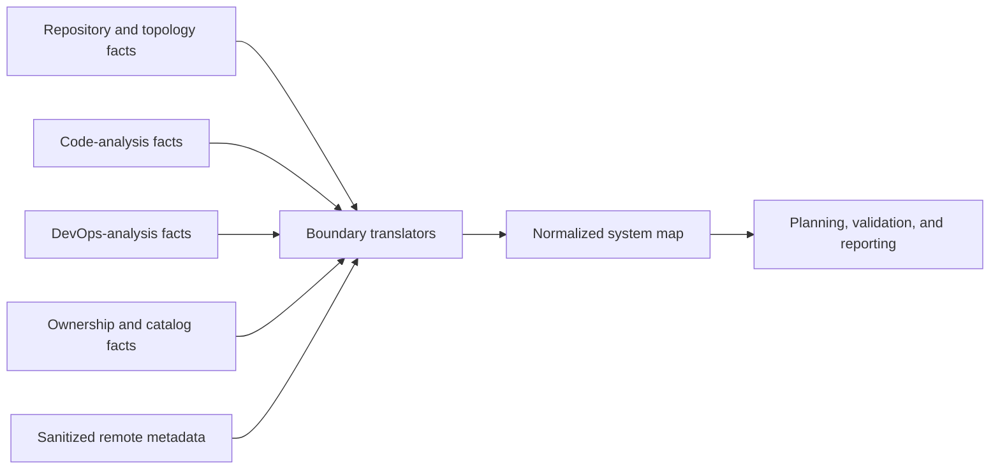

# IATROS System Map Architecture

> **Status: model contract implemented; source translators and reporting are pending.**

See also:

- [Unified system map product contract](../product/0005-system-map-contract.md)
- [Stable core domain contracts](../product/0002-core-domain-contracts.md)
- [Repository topology architecture](topology.md)
- [Scaling profiles](scaling-profiles.md)
- [Security architecture](security.md)

## 1. Capability boundary

`internal/systemmap` owns the provider-neutral aggregate view of one software system. It is downstream of
specialized analysis domains and must not become a replacement for their detailed models. A topology analyzer
can preserve dependency-manager semantics; a DevOps analyzer can preserve deployment semantics; a future
translator projects only the stable cross-domain identities and relationships needed by the system view.

The direction is:

`internal/systemmap` does not import provider SDKs, CLI frameworks, persistence drivers, or transport types.
Provider adapters translate remote responses at the boundary. The current implementation supplies the model,
normalization, validation, and limits; the translators in the diagram are not implemented yet.

## 2. Model shape

The schema `1.0` model keeps distinct entity collections for repositories, services, libraries,
infrastructure, environments, owners, and external resources. This preserves required fields and makes invalid
states easier to reject than a generic node with arbitrary properties.

Relationships use a small typed endpoint containing an entity kind and identifier. The graph can therefore
express ownership, containment, runtime dependency, deployment, delivery, and environment associations without
placing every possible edge into each entity. Relationship kinds remain normalized identifiers so new
cross-domain semantics do not require a core enum release, while endpoint kinds stay closed because they
control reference integrity.

## 3. Source and ownership rules

A repository is either local or remote:

- a local repository has a safe root-relative locator, no provider, an optional sanitized revision, and
  root-target evidence;
- a remote repository has a normalized provider, lowercase credential-free locator, required immutable
  revision, and provider evidence;
- repository evidence refers only to the repository whose identity it supports;
- one physical source location cannot appear under multiple repository IDs in the same system.

Services, libraries, and infrastructure are repository-owned facts. Environments are system-wide operational
contexts. External resources explicitly sit outside the ownership boundary. An owner becomes part of the map
only when a declared source identifies it; ownership edges are not inferred from commit history.

## 4. Evidence and partial results

Every retained fact has evidence. Filesystem evidence uses forward-slash repository-relative paths and reuses
the central path-safety policy. Provider evidence has a sanitized textual reference and cannot also carry a
path. The shared security policy rejects URLs, user information, query strings, fragments, parameter-like
values, authorization headers, and bearer or basic credential forms. Evidence always identifies its
repository, which prevents ambiguous paths in a polyrepository map.

The map can be partial because a repository could not be read, a format was unsupported, a fact conflicted,
or a resource budget was reached. Partial state is valid only with a warning or error diagnostic. A complete
map may retain informational diagnostics but cannot contain a warning or error.

## 5. Determinism and ownership of memory

`Model.Normalized` clones every top-level collection and every nested evidence and environment slice. It then
sorts identity-bearing collections, sorts and compacts nested values, and initializes nil collections. Callers
can release or mutate their inputs without altering the normalized result.

Validation expects normalized input. Strict ordering simultaneously rejects duplicate identities and avoids
depending on map iteration order. Reference indexes are built once, so endpoint checks are linear in retained
entities and relationships rather than repeated scans.

## 6. Resource behavior

System-map limits are part of the unified scaling profile. They bound every top-level collection,
environments per entity, evidence per fact, diagnostics, retained text, and execution time. The built-in
profiles cover small systems, large monorepository or polyrepository systems, and calibrated Enterprise
workers. Implementations allocate for observed facts and must not preallocate the configured maximum.

The system-map repository limit is independent from local nested-repository discovery. A future remote system
may contain repositories that are not nested below one filesystem root.

## 7. Translation rules for later stages

A translator must:

1. accept only normalized, validated upstream results;
2. preserve the upstream repository and evidence identity;
3. emit stable identifiers deterministically;
4. merge only facts whose identity and required attributes agree;
5. report conflicting required attributes as diagnostics instead of choosing by input order;
6. never copy secrets, provider SDK values, absolute paths, or unresolved configuration values;
7. honor cancellation, the selected limits, and deterministic ordering;
8. return an explicit partial result when any admitted source is omitted.

Incremental storage, graph queries, and distributed assembly remain separate implementation decisions. They
must preserve schema `1.0` behavior and cannot make a provider-specific store part of the core model.
