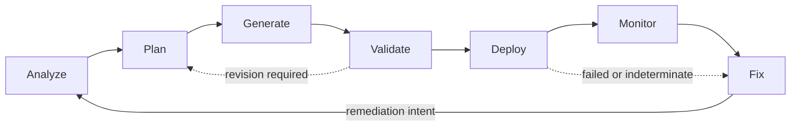

# IATROS Product Contract

- **Product status:** Approved
- **Implementation status:** In progress
- **Contract version:** 1.0
- **Approved:** 2026-08-03
- **Applies to:** All IATROS distributions, subscriptions, and product surfaces
- **Current delivery scope:** Local-only Basic MVP without AI

Related documents:

- [PS-0001: Local Repository Analysis](0001-local-repository-analysis.md)
- [PS-0010: Doctor and Artifact Validation Contract](0010-doctor-validation-contract.md)
- [IATROS target architecture](../architecture/README.md)
- [Security architecture](../architecture/security.md)
- [ADR-0002: Single provider-neutral core with optional subscriptions](../architecture/decisions/0002-single-core-with-optional-subscriptions.md)
- [ADR-0004: Control state-changing operations](../architecture/decisions/0004-control-state-changing-operations.md)

## 1. Purpose and status

IATROS is a provider-neutral DevOps workflow product that turns an explicitly scoped operational intent into evidence, a reviewable plan, candidate changes, validation results, controlled effects, operational signals, and verified remediation.

This document is the canonical product-level contract. It defines the final product boundary, lifecycle, and subscription responsibilities without claiming that every capability is already implemented. Feature specifications define smaller user-visible increments and remain the authority for current runnable behavior.

The first implementation is the Basic MVP. It remains local-only and independent from AI and hosted IATROS services. The runnable feature specification is read-only repository analysis. Internal deterministic artifact validation and Doctor auditing are implemented under PS-0010, while their CLI and lifecycle integration remains pending. Deterministic Docker and DevOps architecture generation will be added through later approved Basic specifications. State-changing operations, continuous monitoring, AI assistance, private company plugins, and every broader capability remain target behavior until their own approved specifications, source, tests, and documentation prove availability.

## 2. Primary users

IATROS serves:

- software developers who need understandable operational guidance without mastering every underlying tool;
- DevOps, platform, site-reliability, security, and cloud engineers who need repeatable evidence, validation, and controlled automation;
- technical leads and operators who need review, governance, auditability, and operational visibility at team or organization scale.

AI assistance is unavailable in Basic. Pro uses cloud AI, while Enterprise may use cloud AI or a local company-controlled AI deployment. AI may improve explanation, planning, generation, validation guidance, diagnosis, and remediation, but it never becomes an authority source.

## 3. Product boundary

### 3.1 Inside the IATROS boundary

| Responsibility | Product contract |
| --- | --- |
| Product surfaces | CLI, API, MCP, dashboard, source-control applications, and IDE integrations submit intent and present normalized results. |
| Provider-neutral core | Owns the lifecycle, project model, evidence, plans, candidate artifacts, validation, controlled effects, monitoring interpretation, and remediation orchestration. |
| Policy and control | Binds actor, scope, target, plan, validation, approval when required, execution, verification, and audit evidence. |
| Plugin runtime | Exposes narrow capabilities through versioned contracts and prevents provider-specific behavior from entering the core. |
| Provider adapters | Translate source control, CI/CD, cloud, cluster, infrastructure, database, observability, security, incident, cost, and AI systems into normalized capabilities. |
| Optional capabilities | Add Pro AI or private Enterprise capabilities through public contracts without copying or replacing the core. |

Logical responsibilities inside this boundary do not require a particular process count, network topology, storage engine, or deployment model.

### 3.2 Outside the IATROS boundary

The following remain external systems or authority sources:

- customer repositories, artifacts, environments, infrastructure, clusters, databases, and workloads;
- source-control, CI/CD, cloud, observability, security, incident, identity, secret-management, and AI providers;
- compilers, package managers, infrastructure engines, orchestrators, and other tools invoked through explicit adapters;
- organization policy owners and human approvers;
- the correctness and availability of external systems beyond evidence that IATROS can independently verify.

External content, provider responses, plugin output, generated content, and model output are untrusted inputs. They can supply evidence or proposals but cannot grant authority, expand scope, or report an effect as successful without verification.

### 3.3 Boundary by plan

| Boundary | Basic | Pro | Enterprise |
| --- | --- | --- | --- |
| Core execution | Runs locally in the user's environment. | Uses the same local core and adds a configured cloud AI boundary. | Uses the same core and adds company-controlled deployment and integration options defined by contract. |
| Project data | Remains local unless the user explicitly exports a result or invokes an authorized plugin. | Only explicitly selected, minimized, and filtered context may cross the cloud AI boundary. | Data movement follows company policy; local AI keeps model context inside the company-controlled environment. |
| AI | Unavailable. | Cloud AI only. | Cloud AI or local company-controlled AI. |
| Plugins | Open plugins through the public SDK. | Open plugins through the same public SDK. | Open plugins plus entitled closed plugins distributed to authorized company environments. |
| Network | The core performs no implicit discovery or hosted-service calls. A released plugin may contact only its declared destination after an explicit request. | Adds explicit cloud AI requests and retains the same declared-plugin rule. | Network access, egress, private endpoints, and offline operation follow company policy and the selected AI placement. |
| External effects | Require an explicit target, validated candidate, applicable policy, and verification. | Identical; cloud AI cannot grant effect authority. | Identical; company plugins and local AI cannot grant effect authority. |

Plan selection is a composition and entitlement concern. Provider-neutral domain behavior must not branch on billing state; it consumes available capabilities through contracts and returns an explicit unavailable result when a capability is absent.

### 3.4 Generated DevOps architecture boundary

IATROS may create candidate artifacts in the following released and installed capability categories:

| Category | Representative artifacts |
| --- | --- |
| Application packaging | Dockerfiles, build contexts, Compose definitions, development containers, image metadata, and runtime configuration. |
| Delivery | CI/CD workflows, build and release definitions, promotion rules, GitOps configuration, and rollback procedures. |
| Infrastructure | Infrastructure-as-code modules, environment definitions, network, compute, storage, database, and secret references. |
| Platform | Kubernetes and other supported orchestration resources, policies, ingress, service configuration, and deployment topology. |
| Operations | Observability configuration, dashboards, alerts, service objectives, runbooks, incident hooks, backup, recovery, and cost controls. |
| Security | Scanning configuration, policy, access declarations, supply-chain metadata, and compliance evidence configuration. |

This is an extensible capability boundary, not a claim that every provider and format is already supported. A generator must declare the artifact kinds, versions, inputs, limitations, validators, and ownership rules it supports.

IATROS owns the plan, candidate content, diff, provenance, validation result, and controlled workflow. The target tool or provider remains responsible for interpreting and applying its native format. IATROS must verify observable postconditions instead of treating a tool's acknowledgement as proof of correctness.

General application feature development is outside the product boundary. IATROS may propose a bounded application change only when it is required for packaging, configuration, health, telemetry, security, delivery, or another explicit DevOps concern. Such a change remains a candidate and follows the same validation and authorization path.

Generated customer-project artifacts do not belong under this repository's `deploy/` directory. That directory contains deployment resources for IATROS itself.

### 3.5 Plugin boundary

Open and closed plugins use the same public contracts and conformance requirements:

- an open plugin may be created, tested, installed, and publicly distributed under any plan;
- a closed plugin is an Enterprise entitlement and may be distributed only to authorized company environments;
- source availability and licensing do not establish trust; every plugin is an untrusted capability implementation;
- each plugin declares identity, version, compatibility, provenance, required permissions, network destinations, data classes, resource limits, and effect classes;
- the runtime validates compatibility and grants only task-scoped capabilities;
- plugins receive secret references or brokered operations rather than unrestricted credential values;
- plugins cannot import private core packages, change plan entitlements, authorize their own effects, or bypass validation and audit;
- a closed plugin must pass the same base conformance suite plus entitlement, isolation, private-distribution, upgrade, and revocation tests.

Open first-party plugin source may live in this public repository. Customer-specific closed plugin source may be maintained and distributed outside the public repository; only its supported contract, verified package identity, declared capabilities, and normalized runtime behavior cross into IATROS.

### 3.6 AI and data boundary

- Basic never sends project context to an AI service.
- Pro sends only user-approved, task-scoped context to the configured cloud AI service.
- Enterprise cloud AI follows company egress and data policies; Enterprise local AI keeps model inputs and outputs within the company-controlled AI environment unless an explicit policy permits transfer.
- Secret values, private keys, tokens, credentials, and unrelated repository content are excluded from model context by default.
- The user-visible workflow identifies when AI is used, which data classes are permitted, which provider or local runtime receives them, and whether retention may occur.
- AI receives structured, capability-scoped tools rather than ambient filesystem, network, shell, provider, or credential access.
- Model output remains attributable, bounded, cancellable, and subject to deterministic validation.

## 4. Supported scope

The final product scope includes:

- local Basic analysis and deterministic DevOps architecture generation;
- Pro cloud-AI assistance over explicitly selected project context;
- Enterprise cloud or local AI and private company plugins;
- explicitly configured remote provider operations through declared plugin capabilities;
- common backend languages, build and dependency systems, and popular DevOps infrastructure through extensible capability catalogs and plugins;
- repository, delivery, infrastructure, platform, observability, security, incident, reliability, and cost workflows;
- evidence-based planning and candidate artifact generation;
- validation before external effects;
- policy-controlled deployment, change application, promotion, rollback, and reconciliation;
- monitoring, drift detection, diagnosis, and remediation loops;
- deterministic text and machine-readable contracts with provenance and bounded resource use.

IATROS itself is implemented in Go. The provider-neutral model must not assume that analyzed projects use Go, and support for another language or tool must not require a fork of the core.

The provider-neutral core is local-first. Basic requires no IATROS-hosted service. Remote access is permitted only through an explicit user-selected cloud AI or plugin capability, bounded scope, authenticated capability, and applicable policy. Discovery must never silently search a LAN, account, cluster, organization, or cloud subscription.

## 5. Product non-goals

IATROS does not:

- replace source control, CI/CD, cloud platforms, orchestrators, infrastructure-as-code engines, observability systems, secret managers, or incident systems;
- treat AI, generated commands, repository content, or plugins as authorization;
- promise universal semantic support for every language, provider, resource, or proprietary workflow without an implemented capability and evidence contract;
- bypass native provider safety controls or conceal provider failures;
- guarantee that every external operation is reversible;
- execute an unvalidated candidate as a trusted change;
- act as a general-purpose application feature generator unrelated to DevOps concerns;
- claim support for a provider, artifact, or version that no installed generator and validator contract covers;
- make Basic depend on Pro or Enterprise code or services;
- fork provider-neutral core behavior by subscription;
- require a control plane, worker fleet, or hosted service for local Basic workflows;
- present planned behavior, detected markers, or incomplete evidence as verified success.

## 6. Product invariants

Every distribution, subscription, and surface preserves these rules:

1. One provider-neutral IATROS core is the source of lifecycle behavior.
2. The user or calling system supplies explicit intent and scope.
3. Claims are traceable to evidence and provenance.
4. Proposals and generated artifacts are not execution authority.
5. State-changing work is validated and policy-controlled before execution.
6. Execution uses least-privileged, scoped capabilities rather than ambient authority.
7. Postconditions are verified; unknown outcomes are reported as indeterminate.
8. Cancellation, partial results, denials, and failures are never represented as success.
9. Sensitive values are minimized and excluded from reports, model context, logs, and audit evidence by default.
10. Resource use, retained output, and external requests are bounded by explicit profiles.
11. The same semantic result is available to human-readable and machine-readable surfaces.
12. Subscription entitlements add capabilities; they do not change the meaning of the lifecycle contract.
13. AI output remains advisory and untrusted until deterministic validation and applicable authorization succeed.
14. Project data crosses a local, cloud, provider, or plugin boundary only through an explicit scoped capability.
15. Open and closed plugins satisfy the same core contracts; privacy or licensing never substitutes for conformance or trust controls.

## 7. Core product lifecycle

The canonical IATROS lifecycle is **Analyze → Plan → Generate → Validate → Deploy → Monitor → Fix**. A completed Fix produces a new remediation intent and re-enters Analyze when another change is required.

The lifecycle is a contract, not a requirement to mutate a target. A workflow may stop after any stage, and read-only workflows normally stop after Analyze, Plan, or Validate. Monitor may run continuously and may start a new Analyze stage when it detects an actionable signal.

Every stage has an explicit entry gate and produces an immutable result:

| Stage | Entry gate | Successful result | Permitted effect |
| --- | --- | --- | --- |
| Analyze | Explicit scope and permitted evidence sources. | Analysis snapshot with evidence, findings, provenance, completeness, and diagnostics. | Read-only observation. |
| Plan | User intent and an accepted analysis snapshot; partial evidence must be acknowledged. | Structured plan with steps, effects, risks, prerequisites, verification, and fallback. | Proposal only. |
| Generate | Selected plan, supported generator capability, and explicit output or staging target. | Candidate artifacts with diff, provenance, content identities, ownership, and diagnostics. | Candidate or staging writes only; no target deployment. |
| Validate | Plan plus candidate identities, or an externally authored candidate with provenance. | Pass, pass-with-warnings, or fail decision bound to exact inputs and checks. | Read-only checks and declared non-mutating dry runs. |
| Deploy | Current passing validation, exact plan and candidate identities, policy decision, authorization, and approval when required. | Verified success, verified failure, verified rollback, denial, cancellation, or indeterminate outcome. | Explicit scoped external effects. |
| Monitor | Explicit observation scope, signal sources, time range, and expected state or objectives. | Operational snapshot with health, drift, incidents, findings, freshness, and diagnostics. | Read-only observation. |
| Fix | Validated problem signal and sufficiently fresh evidence. | Advisory resolution, manual action, or remediation intent for a new controlled cycle. | Proposal only; no direct target mutation. |

### 7.1 Analyze

**Purpose:** establish a trustworthy description of the selected current state.

Analyze accepts an explicit scope and permitted evidence sources. It discovers project structure and operational topology, normalizes supported manifests and provider data, and produces evidence-backed observations, findings, constraints, uncertainty, and diagnostics.

Analyze must:

- remain read-only;
- distinguish observed facts from inference;
- preserve source and freshness information;
- report incomplete visibility as partial rather than complete;
- avoid executing repository code or detected tools unless a later specification defines a separately authorized sandbox capability.

**Required result:** a bounded analysis snapshot with scope, evidence, findings, provenance, completeness, and diagnostics.

### 7.2 Plan

**Purpose:** convert a desired outcome and current-state evidence into a reviewable course of action.

Plan accepts an analysis snapshot, user intent, applicable constraints, and available capabilities. It describes ordered steps, dependencies, expected effects, risks, prerequisites, verification, fallback or compensation, and unresolved decisions.

Plan must:

- reference the evidence and assumptions that support each consequential decision;
- distinguish read-only work from state-changing effects;
- identify targets and expected postconditions;
- expose uncertainty and alternatives rather than silently guessing;
- remain a proposal with no execution authority.

**Required result:** a structured, reviewable plan or an explicit refusal explaining which evidence, capability, or decision is missing.

### 7.3 Generate

**Purpose:** create exact candidate artifacts needed by the selected plan.

Generate may produce source changes, configuration, infrastructure definitions, pipeline definitions, policy, runbooks, commands represented as structured steps, or provider requests. It also produces a deterministic diff or equivalent change representation, provenance, and content identity.

Generate must:

- write only to an explicit staging destination or return content without writing;
- preserve existing user content unless the selected strategy explicitly replaces it;
- identify generated, reused, and user-owned content;
- avoid credentials and unresolved sensitive values;
- treat every output as a candidate, not as a trusted or deployed artifact.

Generate may be skipped when a plan requires no artifact or when an externally authored candidate enters IATROS through the Validate boundary with explicit provenance.

**Required result:** candidate artifacts with their plan reference, diff, provenance, content identity, and generation diagnostics.

### 7.4 Validate

**Purpose:** determine whether a plan and its candidates are safe and suitable to present for execution.

Validate performs the applicable structural, syntax, schema, semantic, dependency, security, policy, compatibility, and dry-run checks. It confirms scope and detects drift between the evidence, plan, candidate, and current target state.

Validate must:

- use deterministic checks where available and label probabilistic or advisory checks;
- validate untrusted generated and external content;
- preserve every blocking error, warning, skipped check, and supporting evidence;
- invalidate results when the bound plan, artifact, target, policy, or relevant state changes;
- keep validation success separate from authorization to deploy.

**Required result:** a validation decision of pass, pass with warnings, or fail, together with checked identities, diagnostics, evidence, and skipped checks.

### 7.5 Deploy

**Purpose:** apply an exact validated change to an explicitly authorized target and verify the outcome.

Deploy is the lifecycle name for any external state-changing effect, including repository changes, pull requests, pipeline operations, infrastructure changes, application releases, promotion, rollback, and reconciliation. It is not limited to application release deployment.

Deploy must:

- accept only the exact validated plan and candidate identities;
- pass policy and authorization checks immediately before the effect;
- obtain approval when applicable policy requires it;
- use a least-privileged, target-scoped capability;
- preserve idempotency and cancellation semantics where the provider permits them;
- verify postconditions independently from a provider's acknowledgement;
- produce sanitized audit evidence for the decision, effect, and verification.

If the effect may have occurred but verification cannot establish the postcondition, Deploy reports an indeterminate outcome and routes the workflow to reconciliation. It never reports unknown state as success.

**Required result:** verified success, verified failure, verified rollback, denial, cancellation, or indeterminate outcome with effect and verification evidence.

The detailed effect classification, approval, identity, and policy mechanisms remain governed by focused architecture decisions. Their implementation may evolve, but no distribution or subscription may bypass this product-level control boundary.

### 7.6 Monitor

**Purpose:** compare observed operation with expected state and objectives after or independently of deployment.

Monitor consumes explicitly configured telemetry, provider inventory, health, delivery, incident, security, drift, reliability, and cost signals. It correlates signals with project topology and previous lifecycle evidence.

Monitor must:

- remain read-only;
- identify source, time range, freshness, and missing visibility;
- distinguish symptoms, correlations, and verified causes;
- deduplicate and prioritize actionable signals;
- avoid silently expanding observation scope.

**Required result:** a bounded operational snapshot containing health, drift, findings, incidents, diagnostics, and evidence-backed triggers for further analysis or remediation.

### 7.7 Fix

**Purpose:** turn a validated finding, failed outcome, drift signal, or incident into a controlled remediation workflow.

Fix correlates the problem with current evidence, proposes remediation options, estimates impact and urgency, and creates a remediation intent. It may recommend rollback, roll-forward, reconciliation, configuration change, code change, or a documented manual action.

Fix must:

- preserve the original signal and causal evidence;
- avoid claiming root cause when evidence supports only correlation;
- distinguish temporary mitigation from durable remediation;
- account for changes since the triggering evidence was collected;
- return state-changing remediation to Analyze or Plan rather than applying it directly.

**Required result:** a resolved advisory outcome, a manual-action record, or a remediation intent that re-enters Analyze → Plan → Generate → Validate → Deploy.

## 8. Lifecycle transition rules

1. Analyze is the default entry for a new intent; Validate is an allowed entry for an externally authored candidate, and Monitor is an allowed entry for an operational signal.
2. Every stage consumes a normalized result or explicitly declares why an earlier stage is not applicable.
3. A stage may stop, refuse, or request more evidence without forcing the rest of the lifecycle.
4. Plan may use a partial analysis only when the missing visibility is explicit and does not invalidate the proposed scope; otherwise it returns blocked.
5. Generate cannot directly authorize or execute its output.
6. Validation pass-with-warnings is not automatic deployment permission; policy decides whether every warning is acceptable for the target and effect class.
7. Deploy cannot bypass Validate, policy, authorization, or postcondition verification, and it rechecks their bound identities immediately before an effect.
8. Monitor and Fix cannot mutate external state; their state-changing recommendations re-enter the controlled lifecycle.
9. Material drift in scope, evidence freshness, target state, plan, artifact, capability, policy, validation, or approval invalidates affected downstream results.
10. A changed input creates a new stage result rather than mutating or relabeling a previously reviewed result.
11. Retries retain the original workflow identity, create a new attempt identity, and use an idempotency identity where effects are possible.
12. Cancellation stops new work and revokes unused capabilities. If an effect may already have occurred, the result is verified or indeterminate rather than `cancelled` or successful.
13. Each stage enforces resource limits and preserves partial, skipped, or unavailable work in diagnostics.
14. Evidence and candidate retention follow configured privacy, sensitivity, and subscription policies without changing result semantics.

## 9. Common lifecycle semantics

### 9.1 Terminal outcomes

| Outcome | Meaning |
| --- | --- |
| `completed` | The stage satisfied its complete contract for the declared scope. |
| `partial` | The result contains a trustworthy bounded subset, and every missing or skipped part is explicit. |
| `blocked` | The stage cannot continue without additional evidence, a user decision, a capability selection, or a satisfied prerequisite. No external effect occurred. |
| `unavailable` | The requested stage or capability is not implemented, installed, compatible, or reachable. No external effect occurred. |
| `failed` | An error prevented a trustworthy contract result. Any possible external effect is separately accounted for. |
| `cancelled` | Cancellation stopped the stage before any unaccounted external effect. |
| `denied` | Policy, authorization, approval, entitlement, or scope rules refused the requested operation. |
| `rolled_back` | A started external effect did not achieve or retain the requested postcondition, and compensation restored a separately verified state. |
| `indeterminate` | An external effect may have occurred, but its postcondition cannot yet be verified. Reconciliation is required. |
| `skipped` | The workflow explicitly declared the stage not applicable and recorded why. |

`completed` is the only unconditional success outcome. A feature specification may permit a `partial` result to continue, but it must define the acceptable missing evidence and cannot present partial coverage as complete. Deploy never uses `partial` for a partially applied external effect; it reports `failed`, `rolled_back`, or `indeterminate` according to verified state. `indeterminate` is valid only for work that may have caused an external effect. The early `not_implemented` analysis stub is a feature-specific representation of the `unavailable` semantic outcome.

### 9.2 Identity, immutability, and provenance

Stage contracts must preserve enough information to connect the complete workflow:

- stable workflow, stage-result, attempt, actor, and surface identities where applicable;
- selected organization, project, repository, environment, provider, resource, and filesystem scope as applicable;
- immutable input identities, output identities, contract versions, capability versions, and provenance;
- `completed`, `partial`, `blocked`, `unavailable`, `failed`, `cancelled`, `denied`, `rolled_back`, `indeterminate`, and `skipped` outcomes as applicable;
- findings, diagnostics, skipped checks, policy decisions, and verification evidence;
- timestamps only when they represent meaningful external or operational events;
- safe next actions that do not imply authorization.

A reviewed plan, generated candidate, validation result, approval, or deployment record is immutable. Corrections create a new result that references the superseded result. Exact content identities bind validation and approval to the reviewed inputs and prevent a later artifact from reusing stale authority.

### 9.3 Standard workflow profiles

| Profile | Stages | Intended outcome |
| --- | --- | --- |
| Inspect | Analyze | Evidence-backed local or provider snapshot with no target mutation. |
| Advise | Analyze → Plan | Reviewable recommendations without generated or deployed changes. |
| Prepare | Analyze → Plan → Generate → Validate | Validated candidate artifacts and diagnostics, ready for review or later execution. |
| Change | Analyze → Plan → Generate → Validate → Deploy → Monitor | Explicitly authorized change with verified outcome and initial observation. |
| Operate | Monitor → Fix → Analyze → Plan | Operational signal converted into a fresh remediation plan; later stages run only when a change is selected. |
| Validate external candidate | Validate → Deploy → Monitor | Externally authored candidate normalized, validated, explicitly authorized, applied, and observed. |
| Reconcile | Analyze → Plan → Generate when needed → Validate → Deploy → Monitor | Indeterminate or drifted state inspected and driven to an explicitly defined postcondition. |

Profiles are compositions of the same stage contracts, not separate implementations. Basic uses deterministic capabilities, Pro may add cloud AI, and Enterprise may add cloud or local AI and private plugins; none of those plan choices changes a stage gate or terminal-outcome meaning.

These are semantic requirements, not a frozen public wire schema. Each public schema must be versioned through an approved feature specification before release.

## 10. Subscription model

IATROS has one provider-neutral core and three cumulative plans: Basic, Pro, and Enterprise. Every plan uses the same lifecycle and deterministic safety controls.

Subscription boundaries follow these rules:

1. Basic is free and provides local work, deterministic DevOps architecture generation without AI, and open plugin development.
2. Pro includes Basic and adds cloud AI for AI-assisted DevOps architecture creation.
3. Enterprise includes Pro and adds a choice of cloud or local company-controlled AI plus private closed plugin development and distribution.
4. Open plugins use the public plugin SDK and may be created and distributed under Basic, Pro, or Enterprise.
5. Closed plugins are an Enterprise capability and are distributed only to authorized company environments.
6. Pro AI, Enterprise AI runtimes, and closed plugins integrate through explicit contracts; the core never imports them.
7. No plan may weaken validation, scope confinement, secret handling, verification, or truthful outcome reporting.
8. A missing entitlement produces an explicit capability-unavailable result; it does not silently alter a result or downgrade a safety check.
9. Exact pricing, packaging, distribution, support terms, service quotas, and contract terms are release decisions rather than lifecycle semantics.

The canonical capability matrix is:

| Capability | Basic | Pro | Enterprise |
| --- | --- | --- | --- |
| Access model | Free. | Paid individual subscription. | Paid company subscription and customer contract where applicable. |
| Provider-neutral lifecycle | Full deterministic contracts as released. | Same contracts. | Same contracts. |
| Core execution | Local. | Local core with cloud AI calls. | Same core with company deployment options defined by contract. |
| DevOps architecture generation | Deterministic templates, rules, catalogs, and open plugins. | Basic generation plus cloud AI. | Pro generation plus cloud or local AI and private company capabilities. |
| AI placement | None. | Cloud only. | Cloud or company-controlled local AI. |
| Open plugin creation and use | Included. | Included. | Included when company policy permits it. |
| Closed plugin creation and use | Unavailable. | Unavailable. | Included through entitled private distribution. |
| Public plugin SDK and conformance tools | Included. | Included. | Included. |
| Company-specific private integrations | Only if released as open plugins. | Only if released as open plugins. | Supported through closed plugins and customer specifications. |
| Project-data default | Local. | Local except explicitly selected cloud AI or plugin context. | Governed by company policy and selected AI placement. |
| Deterministic safety controls | Required. | Identical to Basic. | Identical to Basic. |
| Limits, support, and deployment options | Defined by the applicable release. | Defined by the applicable subscription release. | Defined by the customer and Enterprise release specifications. |

### 10.1 Basic

Basic is the free local plan and the foundation of the MVP. It does not use AI.

Basic provides, as its feature specifications reach implementation:

- local execution and local project data processing;
- repository, project, manifest, topology, technology, and readiness analysis;
- deterministic planning and generation based on user choices, validated templates, rules, catalogs, and installed plugins;
- Dockerfiles, Compose definitions, container configuration, CI/CD definitions, infrastructure as code, orchestration configuration, observability configuration, security configuration, runbooks, and other supported DevOps architecture artifacts;
- deterministic validation, diffs, provenance, and machine-readable reports;
- creation, testing, installation, and distribution of open plugins through the public plugin SDK;
- operation without AI calls or a required hosted IATROS service.

"All DevOps architecture" means every architecture category supported by released generators and installed open plugins. Basic must report an unsupported capability honestly instead of fabricating an artifact for an unknown provider or format.

The Basic MVP is delivered incrementally. The current runnable slice starts with local read-only Analyze. The core now also contains deterministic artifact-validation and Doctor contracts awaiting product-surface integration; later Basic specifications add deterministic Plan, Generate, Deploy, Monitor, and Fix capabilities without adding an AI dependency.

### 10.2 Pro

Pro includes every Basic capability and adds IATROS cloud AI.

Pro provides, as its feature specifications reach implementation:

- natural-language analysis and explanations;
- AI-assisted DevOps architecture planning and alternative comparison;
- AI-assisted generation of Docker, delivery, infrastructure, orchestration, observability, security, and operational artifacts;
- AI-assisted validation explanations, risk prioritization, diagnosis, and proposed fixes;
- personal AI settings, context, history, usage limits, and cost visibility;
- explicit controls over which scoped project data may be sent to the cloud AI service;
- creation and distribution of open plugins through the same public plugin SDK as Basic.

Cloud AI output is always identified as generated or advisory. It cannot approve itself, expand scope, access credentials, bypass deterministic checks, or execute a deployment directly. If cloud AI is unavailable or disabled, inherited Basic capabilities continue to work.

### 10.3 Enterprise

Enterprise includes every Pro capability and is intended for companies that require controlled AI placement and private plugin capabilities.

Enterprise provides, as defined by released and customer-specific specifications:

- a choice between IATROS cloud AI and local or company-hosted AI;
- AI-assisted DevOps architecture creation under company data, identity, network, and policy controls;
- creation, testing, signing, installation, and private distribution of closed plugins;
- proprietary provider integrations, company-specific generators, validators, policies, approval flows, templates, catalogs, and remediation workflows;
- private plugin registries, allowlists, compatibility policies, audit evidence, and controlled rollout;
- dedicated resource profiles, deployment options, compatibility guarantees, and support terms defined by contract;
- continued support for open plugins when company policy permits them.

Local AI runs within a company-controlled environment and must not send project data to a cloud AI service unless that transfer is explicitly enabled. Closed plugins may remain proprietary to the subscribing company, but they must use supported plugin or extension contracts and must not copy, fork, or privately import the core.

### 10.4 Inheritance and entitlement enforcement

- Pro inherits every released Basic capability; Enterprise inherits every released Pro and Basic capability.
- A higher plan adds capabilities and limits but does not replace the provider-neutral implementation of an inherited capability.
- Basic does not require a paid entitlement or an IATROS-hosted service.
- Pro and Enterprise entitlements are checked at composition, installation, admission, and immediately before a plan-gated capability is invoked when applicable.
- The provider-neutral core receives an available capability or an explicit unavailable result; it does not contain pricing, billing-provider, customer-contract, or plan-name branches in domain behavior.
- Entitlement metadata cannot grant filesystem, network, provider, credential, or effect authority. Those remain separate capability and policy decisions.
- Cached entitlement data has an explicit issuer, audience, plan, capability set, issue time, expiry, and integrity protection. Unknown, altered, or stale entitlement cannot enable a paid capability.
- Offline Enterprise entitlement behavior, grace periods, and renewal mechanisms must be defined by an Enterprise release specification before implementation.

### 10.5 Expiry, downgrade, and retained results

Paid subscription expiry is a commercial state change, not an implicit security revocation or permission to destroy user data.

- A downgrade or expiry from Pro or Enterprise returns the product to free Basic and preserves every released Basic capability.
- Paid subscription expiry denies new Pro or Enterprise operations according to the applicable release terms, but it never deletes or encrypts local project content to prevent direct access.
- Existing local project files, generated artifacts, diffs, reports, validation results, and audit records remain readable and exportable subject to their normal retention policy.
- Pro expiry prevents new cloud AI requests. It does not rewrite, invalidate, or hide deterministic results or previously generated local files.
- Enterprise expiry prevents new closed-plugin and Enterprise-only invocations unless an applicable grace or offline policy permits them.
- Subscription expiry does not interrupt an in-flight external effect at an unsafe point. The operation proceeds only far enough to reach a verified safe terminal outcome under its original authorization and audit context.
- Security, administrator, credential, plugin, or capability revocation remains separate and may require immediate cancellation, quarantine, or denial according to the affected capability's safety semantics.
- Downgrade never silently substitutes an open plugin, cloud AI, local AI, or generator for the capability originally selected by the user.
- Re-enabling a subscription does not revive stale validation, approval, target state, or capability authority; normal freshness and lifecycle gates still apply.

Direct access to local project artifacts is not conditional on continued subscription. Legal ownership and licensing of IATROS, AI output, open plugins, and customer-specific closed plugins are governed by their applicable licenses and customer terms, but entitlement loss cannot be used to lock local project content inside IATROS. Basic is free; exact Pro and Enterprise pricing remains a release and commercial decision.

## 11. Lifecycle responsibilities by plan

| Stage | Basic | Pro | Enterprise |
| --- | --- | --- | --- |
| Analyze | Deterministic local evidence and bounded reports. | Adds cloud-AI explanation and correlation for explicitly permitted context. | Adds cloud or local AI plus private company evidence sources and rules. |
| Plan | Deterministic plans built from user choices, templates, rules, and open plugins. | Adds cloud-AI plans, alternatives, risks, and verification proposals. | Adds company-controlled AI, private planning rules, policies, and workflows. |
| Generate | Deterministically generates supported Docker and DevOps architecture artifacts. | Adds cloud-AI architecture and artifact generation. | Adds cloud or local AI and private generators, templates, catalogs, and plugins. |
| Validate | Uses deterministic local and open-plugin validators. | Adds AI explanations while deterministic checks remain authoritative. | Adds private validators, company policy gates, approvals, and compliance rules. |
| Deploy | Uses explicit local capabilities and controlled effects when implemented. | AI may prepare and explain a deployment but cannot authorize it. | Adds private integrations, authorization, controlled execution, and verification. |
| Monitor | Uses explicit local and open-plugin read capabilities when implemented. | Adds cloud-AI signal summarization and correlation. | Adds cloud or local AI and private telemetry or incident integrations. |
| Fix | Produces deterministic remediation from evidence, rules, and open plugins. | Adds cloud-AI remediation proposals and trade-off explanations. | Adds company-controlled AI and private remediation, escalation, and audit workflows. |

## 12. Subscription conformance

A release claiming an IATROS plan must prove:

- Basic builds, tests, and operates locally without AI, paid extension source, or a required hosted service;
- Basic access does not depend on a paid entitlement or billing-provider availability;
- Basic deterministic generation works independently from Pro and Enterprise capabilities;
- Pro passes every applicable Basic conformance test, and Enterprise passes every applicable Basic and Pro conformance test;
- the public plugin SDK and conformance suite support open plugins in every plan;
- core packages do not import Pro, Enterprise, AI-provider, or plugin implementations;
- entitlement enforcement remains outside provider-neutral domain behavior and rejects missing, expired, altered, wrong-audience, or wrong-capability assertions;
- Pro cloud AI failures, cancellation, quota exhaustion, or disabled access cannot break inherited Basic behavior;
- Enterprise can select cloud or local AI according to explicit company policy;
- AI inputs require explicit scope and data controls, and AI outputs remain identifiable and untrusted;
- closed Enterprise plugins use supported contracts, enforce entitlement, and remain isolated from unauthorized users and companies;
- lifecycle results retain the same meaning across plans and surfaces;
- unsupported or unsubscribed capabilities fail explicitly without data loss or silent fallback;
- upgrades preserve or explicitly migrate stored contract versions and provenance;
- downgrade and expiry preserve local artifact access, avoid silent capability substitution, and do not revive stale authority after renewal;
- subscription expiry during an external effect reaches a verified safe terminal outcome;
- subscription-specific limits are documented, observable, and applied before unbounded resource acquisition.

Basic remains free. Pro and Enterprise pricing, packaging, licensing, private-plugin ownership, service operation, and commercial terms require separate release or customer specifications. Those decisions cannot redefine the responsibilities established here.
